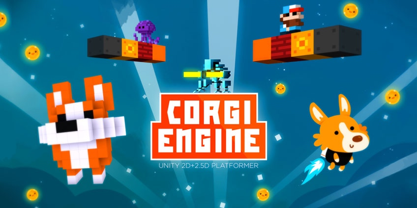

# Corgi Engine 简介

> 欢迎阅读 Corgi Engine 文档，你可以在这里找到关于如何创造一个平台游戏所需要知道的一切。

## 什么是 Corgi Engine？

Corgi Engine 是一个基于 Unity 的 2D + 2.5D 平台游戏套件，在 [Unity 资源商店](https://www.assetstore.unity3d.com/en/#!/content/26617)中可以找到。它拥有一个**基于非物理引擎（non-physics based）实现的高效的玩家控制器**，并且具备**兼容移动设备**、兼容各种资源等特性。基本上，它就是**你开始着手创建一个 2D 游戏所需的一切**。

## 如何开始

首先，**你并不需要阅读完所有文档**。Corgi Engine 的创建过程遵循着 Unity 的最佳实践，并且打包了各种帮助内容。如果这不是你的第一个 Unity 项目，尽管按照你的方式进行，在遇到任何不清晰的地方再回到这里查阅即可。

也就是说，你可以使用**页面左边的目录**导航到相应的主题，这份文档是一个工具。如果你对源代码本身有疑问，你可能需要查阅 [API 文档](http://corgi-engine-docs.moremountains.com/API/)，同时推荐你直接阅读源代码的注释，通常它们就足够解答你可能遇到的很多问题了。

如果你想要一份引擎的功能特性列表，或者想知道某些东西引擎是否已经包含在内，你可以访问[这个页面](http://corgi-engine.moremountains.com/)，它还包含了更新日志和其他有用的东西。

你也可以观看 [YouTube 上的视频教程](https://www.youtube.com/playlist?list=PLl3caEhMYxQEsA5Fbg0M2aB9Q9Z9BTVNS)。

如果以上途径都无法帮助你解决问题，你还可以使用[资源商店中的邮件支持链接](https://www.assetstore.unity3d.com/en/#!/content/26617)来获得帮助。

-------

[本页面的 Corgi Engine 官方英文原版链接](http://corgi-engine-docs.moremountains.com/index.html)

# Introduction to the Corgi Engine

> **Summary:** Welcome to the Corgi Engine Documentation. Here you'll find everything you need to know to create your own platformer game!

## What’s the Corgi Engine?

The Corgi Engine is a Unity 2D + 2.5D Platformer Kit, available on the [Unity Asset Store](https://www.assetstore.unity3d.com/en/#!/content/26617). It’s a **very fast, non-physics based controller** for your player, plus many other features, described below. It’s **mobile friendly**, works well with other assets, and is basically **everything you need to start creating your own 2D game right now**.

## Where do I start ?

First of all, **you don’t have to read all that documentation**. The engine is built with Unity good practices in mind, and is packed with help boxes. So if this is not your first Unity project, you’ll probably be ok on your own. And you can always go back here if something’s not clear.

That said, you can use the **menu on the left** to get to specific places. This documentation is functional. If you have questions about the code itself, you’ll rather want to have a look at [the API documentation](http://corgi-engine-docs.moremountains.com/API/). It’s also recommended to look at the code’s comments directly, usually they cover pretty much any question you might have.

If you want a list of features, or are wondering if this or that is included in the engine, you can have a look [at this page](http://corgi-engine.moremountains.com/). It also includes a changelog, and other useful stuff.

There are also [video tutorials on Youtube](https://www.youtube.com/playlist?list=PLl3caEhMYxQEsA5Fbg0M2aB9Q9Z9BTVNS).

And if all that doesn’t help, you can always use the **support email link** [on the Asset’s page](https://www.assetstore.unity3d.com/en/#!/content/26617).

-------

