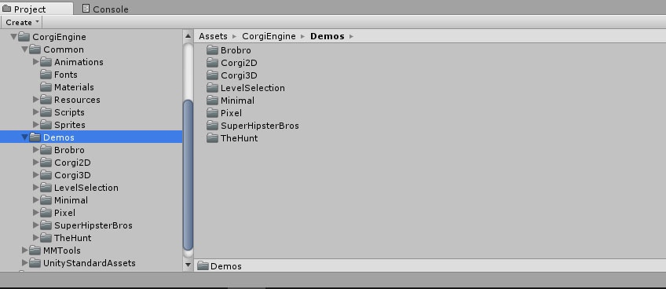

# 资源内容

> 这个页面描述了引擎包含的资源内容。

## 简介

当你把 Corgi Engine 的资源包导入到项目中后，在项目视图中会看到 `CorgiEngine` 文件夹，其中包含 4 个子文件夹。我建议保留引擎原来的文件结构，并且**不要修改它的内容**。取而代之，创建另外一个专门的文件夹来保存你的游戏资源。如果你需要修改引擎的源代码，只需要在你自己的类中扩展引擎的类，你可以通过阅读[「扩展 Corgi Engine」]()部分内容来了解更多。下图是这 4 个子文件夹的内容大纲和目录结构。

## Comon

顾名思义，`Common` 包含了实现游戏中移动控制必需的所有脚本和视觉资源，在你的游戏中需要保留这些文件。它主要由以下文件目录构成：

* **Animations**：所有公共的动画组件，大部分是 GUI 相关
* **Fonts**：各种 GUI 界面上使用的字体都保存在这里
* **Materials**：大部分 Demo 中用到的一些材质，但有特定的几个除外
* **Prefabs**：各个 Demo 关卡中用到的所有 Prefab
* **Resources**：通过代码直接实例化的一些 Prefab
* **Scripts**：引擎的核心部分，也是它最大的价值所在，我们将会详细了解它的细节
* **Sprites**：所有 Demo 公共的 Sprite，同样的，大部分都是 GUI 资源

`Scripts` 目录包含了所有的引擎脚本。每个 Demo 也都有各自的一些脚本，但都放在各自的目录下。请注意，为了更易于维护和更好的逻辑分离，`MMTools` 的脚本放在了根目录的另一个子目录下。以下是 `Scripts` 中的主要目录：

* **Agents**：在这里你可以找到所有控制角色动作和行为的脚本，包括射线投射的碰撞控制器（raycast collision controller）、角色能力、AI 脚本以及武器等等
* **Camera**：各种与摄像机、视差相关的脚本
* **Checkpoints**：大部分是与「游戏循环」相关（重生、关卡结束等等）的脚本
* **Environment**：这个目录包含的大部分是处理关卡中物品对象的脚本，包括下落的方块到瞬间传送装置等
* **GUI**：顾名思义，这个目录包含了所有与 GUI 相关的东西：对话窗、暂停界面等
* **Items**：这个目录包含了金币、可捡拾的武器等东西
* **Managers**：包含了所有管理类（所谓「超类」，通常是单例，处理游戏中全局的东西）
* **Sound**：所有声音相关的脚本都放在这里

## Demos

Demos 目录包含了所有引擎中提供的游戏 Demo。它们按照「游戏世界」（universe）来组织目录结构，一个「游戏世界」可能包含一个或多个场景（Scene）。通常每个 Demo 旨在展示**引擎一个或多个特定的方面**， 或者展示如何通过简单的调整或替换美术资源达到你想要的不同效果。

### Brobro

* **BrobroLevel**：一个可以随意摧毁对象的关卡，灵感来源于 `Free Lives` （独立游戏工作室）的 `Broforce`

### Corgi 2D

* **Lava**：一个炎热的关卡
* **Mesa1**：为这个引擎创建的很早期的关卡，包含了几乎所有东西
* **Mesa2**：经典主题的一个变种
* **Mountains**：一个山脉主题的场景，包含风和落叶
* **Sandbox**：一个主要用于快速测试东西的场景，不需要详细研究，它还存在一些问题

### Corgi 3D

* **3D Level**：一个非常基础的 3D 关卡，包含了一些现成的原型方块

### Level Selection

* **LevelSelection**：一个关卡选择的实现示例，包括了路径控制功能

### Minimal

* **FeaturesPlatforms**：一个交互式的 Demo，展示了资源的所有平台相关特性
* **MinimalLevel**：展示了一个单玩家场景的最小要求
* **Minimal4Players**：展示了一个本地多玩家场景的最小要求

### Pixel

* **PixelLevel**：基于像素瓦片（pixelated tile based）的关卡

### Super Hipster Bros

* **HipsterLevel**：一个经典复古的滚屏平台游戏，灵感来源于 `Super Mario Bros`

### The Hunt

* **TheHunt**：一个多玩家的 3D、4 vs 4 关卡，灵感来源于 `Smash Bros` 和 `Towerfall` 以及类似的游戏

## MMTools

`MMTools` 包含了所有在 `More Mountains` 出品的资源中使用到的辅助类（helper）和小类（small class）。有一些类在 Corgi Engine 可能并没有使用到，但我还是建议**不要移除它们**。那些没被用上的资源并不会让你的构建包变大，所以保留它们是较为安全简单的做法。这份文档不会涉及到它们的细节，但它们都有详尽的注释，如果你感兴趣，也可以查阅 API 文档中的相关解析。

## InventoryEngine

在 Corgi Engine 的 v4.0 版本中有介绍到，Inventory Engine 是 `More Mountains` 完整的装备解决方案。除去这个（通常是）单独的资源，你还是可以使用 Corgi Engine 的专用 Demo 和物件。

## UnityStandardAssets

在某些 Demo 关卡，Corgi Engine 基于 Unity 标准资源中的 Cinematic Effect 实现了一些火花特效，这些**纯粹出于美化而且是可选的**。值得一提的是它们在某些设备上可能会损害性能，所以请按需安全地移除它们。

-------

