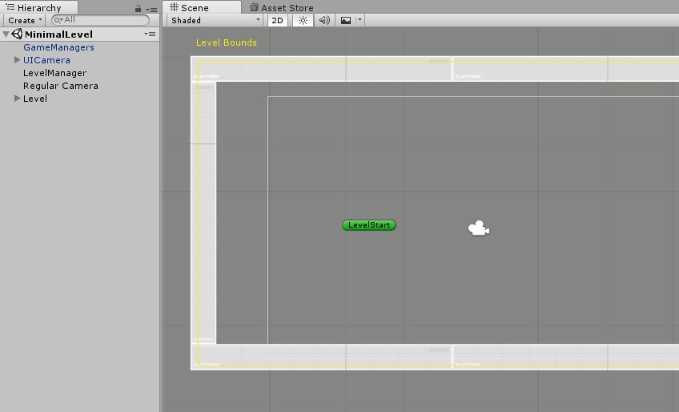
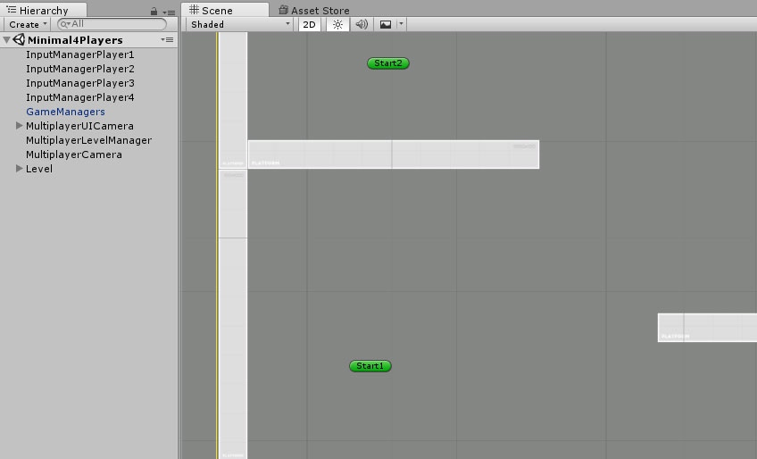

# 最小场景要求

> 这个页面描述了为了让你的引擎跑起来，你的场景中至少需要包含的所有 GameObject。

## 简介

与大多数 Unity 项目类似，在 Corgi Engine 中，一个关卡由一个场景组成（a level is made of a Scene）。你可以往场景中添加很多东西（梯子，敌人等等），它可以很庞大，也可以很精简，一切都取决于你。但无论你想做什么，引擎都需要一些基本的组件才能够正常运作。Corgi Engine 包含了两个最小场景的示例，这些场景展示了标准情况下的最小组件要求。严格来说，你甚至还可以从中移除更多东西，但当前它们已经是良好的初始场景了。

## 最小单玩家场景

最小单玩家场景文件在 `CorgiEngine/Demos/Minimal/MinimalLevel` 路径下，它是任何单玩家关卡的一个很好的起点。以下列举了它所包含的对象：

* **GameManagers**：一个包含了 `GameManager` 和 `SoundManager` 脚本的 GameObject。`GameManager` 脚本负责处理玩家得分、时间尺度（Time Scale）、暂停等，通常是一些全局高层的东西。顾名思义，`SoundManager` 负责声音的播放。请注意，这个 GameObject 并非强制要求的（也就是说游戏还是可以启动），你可以移除它，如果你不想使用这些管理类的话。

* **UICamera**：同样是可选的，`UICamera` 是一个独立的摄像机，包含一个 `Canvas` 对象，以及各种 GUI 元素，例如血条、分数之类的东西，你可以将你的 GUI 元素放置在这里。

* **LevelManager**：`LevelManager` 定义了所有游戏角色所需的关卡界限，同时处理玩家角色（Playable Characters）的实例化，以及所有出生/重生机制（当角色死亡时触发）。对于包含有游戏角色的场景来说，这个 GameObject 是强制要求的（不过例如启动界面之类的就不需要）。请确保在 `LevelManager` 的 Inspector 视窗中选择了一个玩家角色。

* **Camera**：通常需要一个包含 `CameraController` 脚本的摄像机，这个组件被引擎用来追踪你的角色，但你可以把它替换成任何你想要的摄像头。

* **Level**：场景中至少需要一个平台供角色站立跳跃。

## 最小多玩家场景

最小多玩家场景文件在 `CorgiEngine/Demos/Minimal/Minimal4Players` 路径下，它是任何多玩家关卡的一个很好的起点。以下列举了它所包含的对象：

* **InputManagers**：在多玩家场景中，每个玩家角色都需要一个 `InputManager` 组件。

* **GameManagers**：与单玩家场景中的一样。

* **MultiplayerUICamera**：一个 `UICamera` 对象，并且它的 `UI Canvas` 组件设置了多玩家专用的布局，它包含了 4 个血条、喷气能量条和玩家名字。当然，你可以（也应该）自定义这些元素来适应特定的游戏主题。

* **MultiplayerLevelManager**：这个组件负责处理多人游戏的生命周期，处理诸如有一个玩家死亡、只剩一个玩家存活、关卡是否应该重启这样的东西。在大多数情况下，你需要创建自己的 `MultiplayerLevelManager` 来实现自定义的规则逻辑。

* **MultiplayerCamera**：一个实现多玩家追踪的摄像机，与游戏 `Smash Bros` 中的类似。

* **Level**：构成关卡场景的平台和物品对象。

-------

