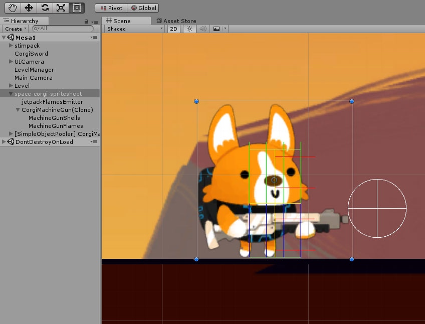
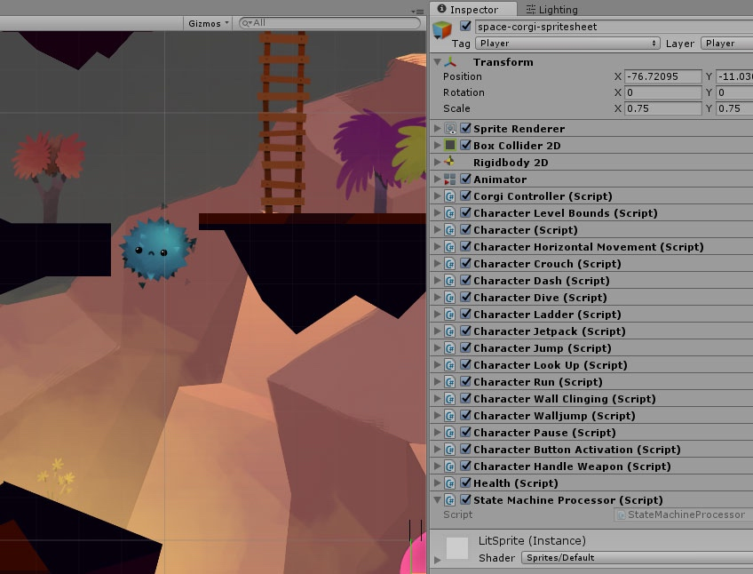
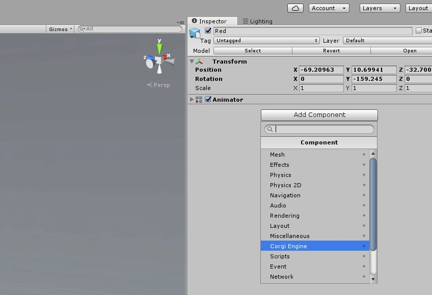
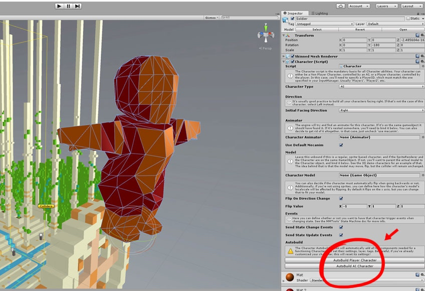
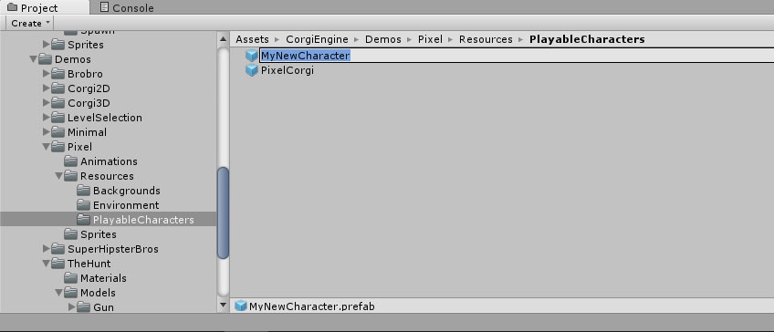

# 如何创建角色

> 这个页面说明了在 Corgi Engine 中角色是如何运作的，以及如何创建你自己的角色。

## 简介

Corgi Engine 用 **Agent** 这一术语来描述任何类型的角色，包括玩家角色、敌人和 NPC 等等。为了让这些 Agent 正常运作，需要一些[核心的类（core classes）](https://github.com/Caizc/corgi-engine-docs/blob/master/2.Agents/2-2.%E8%A7%92%E8%89%B2%E7%B1%BB.md)，如果你想要扩展和创建更多的角色能力，你必须熟悉这些类。

同时，这个页面旨在介绍一些**基本概念**，并且帮助你快速地创建角色（基于玩家控制或者 AI）。请注意，这个页面提到的所有信息（同时对整个文档而言）**只对 Corgi Engine v3.0 或以上版本有效**。

## 基本概念

关于这些角色对象中必不可少的组件，在[另外一个页面](https://github.com/Caizc/corgi-engine-docs/blob/master/2.Agents/2-2.%E8%A7%92%E8%89%B2%E7%B1%BB.md)中会详细探讨，但在这里先做一下**简要说明**。在 Corgi Engine 中，一个 Agent 通常包含这些组件：

* **BoxCollider2D**：碰撞器（collider）的尺寸用来检测碰撞，同时确定 Agent 在场景中的位置
* **RigidBody2D**：只用来提供与标准物理引擎的基本交互作用（这个组件完全是可选的）
* **CorgiController**：CorgiController 基本上是 Unity 标准物理引擎的替代品，它负责碰撞检测、基础移动（左/右移动）、重力等，它提供了更为紧凑的运动感。不过显然，这个组件不是被设计来作为物理引擎的（虽然它具备了某些物理引擎的功能特性）。
* **Character**：这个是链接其他角色类的核心类，虽说它自身并没有实现太多功能，但确实扮演着核心的作用。在这里你可以定义角色是玩家控制的还是 AI 控制的，以及它是否应该翻转、是否基于模型（model based）等等。同时它也控制运行状态下所有的角色能力。
* **Health**：并非必不可少的组件，但在大部分游戏中，你的 Agent 应该可以被杀死。Health 组件处理伤害、加血/掉血以及死亡。
* **Character Abilities**：至此，前面提到的组件已经提供了大量的能力，但并不真正的显式实现功能，而是交由 `Character Abilities` 组件来实现。Corgi Engine 资源打包了超过 15 种角色能力，从简单的水平移动到复杂的武器使用。它们都是可选的，随你挑选。你当然也可以轻松地创造自定义的能力来创建自己的游戏。

## 如何创建一个 Agent？

在 Corgi Engine 中有**很多种方式**可以创建一个玩家或 AI 角色，在此我们会涵盖 **3 种推荐的方式**。请注意，如果你更习惯于用别的可以奏效的方式，也是没问题的。

### 自动创建

在 Corgi Engine v3.0 版本中介绍过，**Autobuild Character** 功能帮助你在几秒钟之内创建一个新的角色。不过需要注意的是，在完成了初始化设置之后，你还需要设置动画等，但这已经比以往的方式快捷得多了。

以下阐述了具体步骤：

1. 在满足了[最小要求](https://github.com/Caizc/corgi-engine-docs/blob/master/1.Overview/1-3.%E6%9C%80%E5%B0%8F%E5%9C%BA%E6%99%AF%E8%A6%81%E6%B1%82.md)的场景中，添加一个 GameObject。
2. 首先需要从一个 **GameObject** 出发，无论是新建一个空的 GameObject，使用一个现成的 Prefab，拖拽一个 Sprite 到场景中，或者使用 Model 都可以。
3. 为 GameObject 添加一个 **Character 组件**。
4. 在 Character 的 Inspector 视窗底部，点击 **Autobuild Player Character** 或者 **Autobuild AI Character**，这取决于你想要创建的角色类型。
5. **点击 Play**。如果你创建的是一个 AI 角色，那它现在应该正在场景中走来走去；如果是一个玩家角色，尝试控制它到处走走。恭喜你，你已经创建了一个角色！
6. 现在你可以调整各种设置，**移除这个角色身上那些你不感兴趣的能力**，或者添加[动画](https://github.com/Caizc/corgi-engine-docs/blob/master/2.Agents/2-4.%E5%8A%A8%E7%94%BB.md)等等。你也可以让它保持现在的样子，**继续制作你的游戏和关卡原型**。

### 拷贝

另一个创建 Agent 的快捷方式是，**在引擎提供的 Demo 中找一个，作为你的蓝本**。

操作步骤也相当简单：

1. 在 Demo 中**找一个你喜欢的 Agent**。
2. **找到它的 Prefab 的所在位置**（在 Scene 视窗中选中该 Agent，然后在它的 Inspector 视窗的最右上方，在 Prefab 的名字和标签下方有一个 Select 按钮，点击按钮定位到 Prefab 的所在位置）。
3. **复制这个 Prefab**（Ctrl + D 或者 Cmd + D）
4. **重命名它**为你的角色的名字
5. **按照你想要的效果修改它**。也许你只是想替换一些设置，或许修改 Sprite 和动画，从这里开始就都取决于你自己了。

### 组件方式

你也可以**从头开始创建一个角色**，虽然会花费更长时间，但又何妨呢？

1. 首先创建一个**空的 GameObject**。理想情况下，你需要将 Character 部分和视觉资源部分分开来。最好的结构层次可能是将 CorgiController/BoxCollider2D/Character/Abilities 这些组件放置在顶层，然后将视觉资源部分（Sprite、Model 等）嵌套在下一层。
2. 在 Inspector 视窗的顶部，**设置它的 Tag 为 Player**，如果它是一个玩家角色的话，如果不是那就设置成相应别的标签。Layer 也是同样道理。
3. 在最顶层的 GameObject 中添加一个 **BoxCollider2D** 组件。调整它的 Size 参数来匹配你的 Sprite/Model 的尺寸。
4. 添加一个 **CorgiController** 组件。设置各个参数（如果需要帮助，请参照角色类的文档），并且确保设置了各种 Collision Masks 参数（Playform，One Way Platform 等）。
5. 添加一个 **Character** 组件。检查各个设置以确保它们如你所要。
6. 添加你想要的角色能力（**Character Abilities**）。最好的方式是通过 Inspector 视窗底部的 AddComponent 按钮来导航并添加这些组件。
7. 视情况需要，添加 **RigidBody2D/Health/HealthBar** 组件等。

-------

[本页面的 Corgi Engine 官方英文原版链接](http://corgi-engine-docs.moremountains.com/how-to-create-character.html)

# How to create your own character?

> **Summary:** This page explains how characters function in the Corgi Engine and how to build your own.

## Introduction

“**Agents**” in the CorgiEngine is a term used to describe any kind of characters, whether they’re playable characters, or enemies, NPCs, etc. There are a few [core classes](http://corgi-engine-docs.moremountains.com/character-classes.html) that make these agents work, and that you’ll need to get familiar with if you want to expand and create more character abilities for example.

In the meantime, this page aims at presenting the **basic concepts** and allowing you to quickly create your own character (player controlled or AI based). Note that all the information on this page (and on that whole documentation for that matter) **only works for Corgi Engine v3.0 or more**.

## Base concepts

[This page](http://corgi-engine-docs.moremountains.com/character-classes.html) goes into more details about the mandatory components of a Character, but here’s a **brief rundown**. An agent in the Corgi Engine usually has these components :

* **BoxCollider2D** : the collider whose size is used to determine collisions and where in the world the agent is
* **RigidBody2D** : only used to provide basic interactions with standard physics (completely optional)
* **CorgiController** : responsible for collision detection, basic movement (move left / right), gravity, the CorgiController is basically the replacement for Unity’s standard physics. It provides tighter movement and feel. Obviously, and by design, this is not a physics engine.
* **Character** : This is the central class that will link all the others. It doesn’t do much in itself, but really acts as a central point. That’s where you define if the player is an AI or player-controlled, how it should flip, if it’s model based, stuff like that. It’s also the class that will control all character abilities at runtime.
* **Health** : Not mandatory, but in most games your agents will be able to die. The Health component handles damage, health gain/loss, and eventually death.
* **Character Abilities** : So far all the previous components offer lots of possibilities, but don’t really “do” anything visible. That’s what Character Abilities are for. The asset comes packed with more than 15 abilities, from simple ones like HorizontalMovement to more complex ones like weapon handling. They’re all optional, and you can pick whichever you want. You can of course also easily create your own abilities to build your very own game.

## How do I create an Agent ?

There are **many ways** you can create a playable or AI character in the Corgi Engine. Here we’ll cover **the 3 recommended ones**. Note that if you prefer doing differently, as long as it works for you, it’s all fine.

### Automatic Creation

Introduced in Corgi Engine v3.0, the “**Autobuild Character**” feature allows you to create a new character in a few seconds. Note that after that initial setup you’ll still have to setup animations and all that, but it’s a lot faster than it used to be :)

Here’s how to proceed :

1. In a scene that meets the [minimal requirements](http://corgi-engine-docs.moremountains.com/minimal-scene-requirements), put a GameObject.
2. You’ll need a **GameObject** to start with. You can create an empty one, take an existing prefab, drag a Sprite on the scene, or a model, it’s up to you.
3. Add a **Character component** to that GameObject
4. At the bottom of the Character’s inspector, press either “**Autobuild Player Character**” or “**Autobuild AI Character**”, depending on what kind of character you’re after.
5. **Press play**. If you went for an AI character, it should be walking around the scene. If it’s a player character, try moving around. You’ve created a Character! :tada:
6. You can now fine tune the various settings, **remove the abilities you’re not interested in** for this character, add [animations](http://corgi-engine-docs.moremountains.com/animations), etc. Or you can leave it like that and **start prototyping** the rest of your game and levels.

### Copy

Another fast way to create an agent is to find one you like in the demos, and **create yours from that**. The process for that is quite simple :

1. **Find an agent you like** in one of the demos.
2. **Locate its prefab** (select the Agent in Scene View, and in its inspector, at the very top right under the prefab’s name and tag there’s a Select button)
3. **Duplicate the prefab** (cmd + D)
4. **Rename it** to whatever you want your Character to be called
5. **Make the changes you want**. Maybe you’ll just want to replace some settings, maybe you’ll want to change the sprite and animations. It’s up to you from there.

### Components approach

You can also **create a Character from scratch**. It’s longer but why not?

1. Start with an **empty gameobject**. Ideally you’ll want to separate the Character part from the visual part. The best possible hierarchy has the CorgiController/BoxCollider2D/Character/Abilities on the top level, and then nests the visual parts (sprite, model, etc).
2. At the top of the inspector, **set the tag to Player** if it’s a player character, or to anything you prefer if it’s not. Same thing for the layer.
3. On your top level object, add a **BoxCollider2D**. Adjust its size to match your sprite/model dimensions.
4. Add a **CorgiController** component. Set the various settings (see the class documentation if you need help with that), and make sure to set the various collision masks (platforms, one ways, etc)
5. Add a **Character** component. Check the various settings to make sure they’re ok with you.
6. Add the **Character Abilities** you want (it’s best to use the AddComponent button at the bottom of the inspector for that, and navigate there)
7. Optionnally, add a **RigidBody2D**, a **Health** component, a **HealthBar** component, etc.

-------

