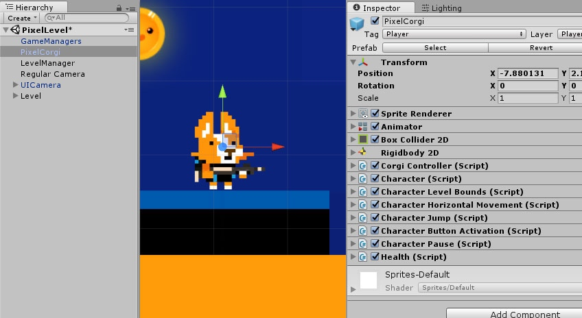
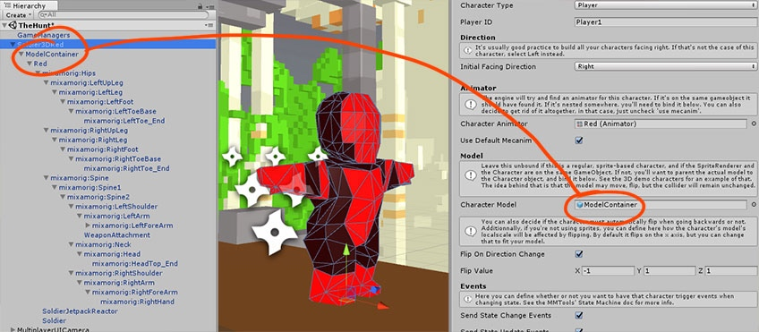
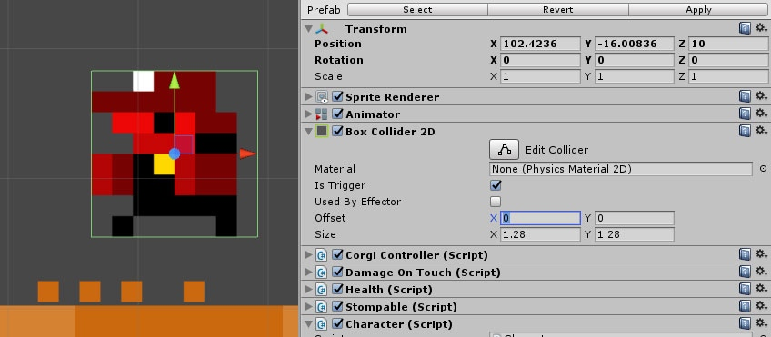
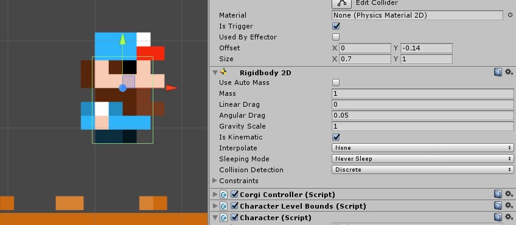
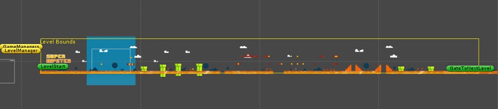

# Character 类

> 这个页面全面讲解了 Character 类，它使用的状态机，以及如何使用它来创建你的角色。

## 层级结构和渲染器

有各种不同的组装角色对象的方式。首先，最简单的方式是**将所有组件都放置在同一个层级中**。

另外一个方式是**使用嵌套结构**。在大部分 3D 模型或者使用像 Spine 这样的 2D 系统时，对象会拥有一个嵌套的层级结构。**这两种情况 Corgi Engine 都能够处理**，而不会对性能或行为产生任何影响。不过如果你决定使用嵌套的方式，则需要确保你在顶层角色对象的 Inspector 视窗中设置了 Animator 和 Model 参数。

系统可以兼容各种不同类型的角色，**可以是 2D、3D 的，这取决于你**。Corgi Engine 资源中包括了典型的基于 Sprite 实现的，由 Spine 驱动的，以及 3D 模型实现的角色示例。

## Collider 与 RigidBody

为了让 Corgi Engine 能够正常运作，你的角色对象上需要有一个 BoxCollider2D 组件（即使它是一个 3D 模型）。Material 设置为空，IsTrigger 设置为 true（勾选之），还要设置 Size 来匹配角色的一部分（可能是整个 Sprite 的大小，但不一定是），以确保你的角色不会穿墙而过，最后把 Offset 的 X 值设置为 0。

另外，如果你想要在 Corgi Controller 和常规的 Unity 物理引擎之间（试验性的）使用基础的物理交互，你可以往对象添加一个 RigidBody2D 组件。在这种情况下，参照下图的设置即可。

## Corgi Controller

创建 Corgi Engine 是为了取代那些基于物理特性的平台游戏，它旨在提供**更为紧凑流畅的游戏体验**，更高效，而且比基于物理特性的实现更易于预测。为此，引擎实现了它自己的「物理特性」：碰撞检测、移动等等。需要明确的是，Corgi Engine 绝对不是一个物理引擎，**它与 Unity 正式的物理引擎没有可比性**，所以如果你计划用它来重新创造一个 Angry Birds，那是不可能成功的。

Corgi Controller 是这个系统的核心，它是**每一个角色的基础**。它的主要功能是处理碰撞和基础移动。你可以给它添加或设置作用力来使它移动，一般是通过 Character Abilities 中的组件。

Corgi Engine 通过发射射线（**Raycast**）来处理碰撞，当你的运行游戏时，你可以在 Scene 视窗中看到它们。它的工作原理从本质上讲就是 Controller 会向它的四周发射一些小射线，像微型激光一样。如果水平的激光击中了物体，那它可能碰到了墙壁或者斜坡。如果竖直的激光击中了物体，那它可能碰到了地面或者天花板。这取决于每一帧应用到对象上的作用力，也取决于射线有没有击中物体，Controller 负责在场景中移动对象，以及在对象穿墙而过之前让它停下来之类的事情。

作为角色的核心，Corgi Controller 在 Inspector 视窗中的设置相当重要。在那里你可以规定重力、各种速度参数，以及什么样的斜坡角色可以攀爬（以及攀爬的速度）等等。

你还需要规定 **Collision Masks**。Corgi Controller 支持与各种不同的平台交互：

* 普通平台（regular platforms，Platforms）
* 移动平台（moving platforms）
* 单向平台（one way platforms，可以从它下方跳上去的平台）
* 单向移动平台（one way moving platforms）

默认情况下，引擎以及配置好了一系列 Layer，每种类型的平台都分别对应一个：Plaforms，MovingPlatforms，OneWayPlatforms，MovingOneWayPlatforms。如果你增加了更多的 Layer，或者修改了这些 Layer，请确保将这些修改应用到你的角色上。

在 Inspector 视窗中你还可以自定义 Raycast，它们的数量事实上取决于你的角色的尺寸大小。调整 Raycast 参数的目标是使用尽可能少的射线（基于性能考虑，虽然现今射线的数量已经不是什么大问题了），但同时射线之间又必须足够紧密，以避免任何平台、敌人或者物品小于两条射线的间距（在这种情况下引擎是无法检测到的）。

## Character 关卡界限

任何一个关卡都有关卡界限（Level Bounds），可以在 LevelManager 组件中定义它。它是包围着上下左右的不可见线框（事实上在 Scene 视窗中是可见的，左上角写着 Level Bounds 的黄色线框就是它），它规定了**摄像机移动到哪里就会停下来**。通过这个组件，你可以决定当角色碰到边界时会发生什么（通常是无作用、受限制或者死亡）。

## Character

Character 是链接其他类的核心类，虽然它本身并没有做太多事情，但确实起着**核心的作用**。在那里你定义了角色是 AI 控制还是玩家控制，什么时候应该翻转，是否基于模型实现等诸如此类的东西。同时它也是在运行状态下操纵 **Character Abilities** 的类。

它是一个非常核心的类，包含在引擎的 v3.0 版本更新中。从它的 Inspector 视窗中你可以定义很多东西。**如果你想创建一个玩家角色，那么 PlayerID 字段将非常重要。**它必须准确匹配到 InputManager 组件中的 PlayerID 字段（InputManager 利用它来得知控制哪个角色）。然后还有一些基本的设置项，例如 Sprite/Mesh 的初始化朝向等。如果 Animator 组件不是放置在角色层级结构的顶层的话，你还可以为它指定一个 Animator。Model 也同样如此（可以是 2D/3D，随你所愿）。

## Health

Health 组件负责处理伤害、加血/掉血，以及死亡和重生。如果你的角色可以受到伤害，该组件则必不可少。有多种方式可以让你从初始血量中加/减血，它还会处理伤害和相关联的效果（视觉上的和碰撞方面等）。

## Character Abilities

角色的最后一部分（并不是说它不重要）是**角色能力（Character Abilities）**。Corgi Engine 资源中打包了超过 15 种能力，从简单的水平移动到复杂的武器使用。**它们都是可选的**，你可以根据需要选用。你当然也可以轻松地创造自定义的能力来创建你的游戏。可以通过查阅[这个页面](http://corgi-engine-docs.moremountains.com/character-abilities.html)的内容来详细了解 Character Abilities。

-------

