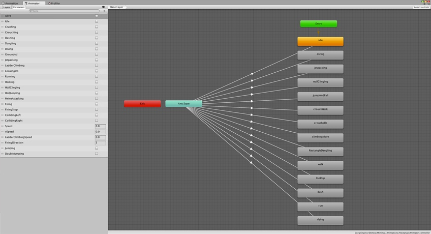
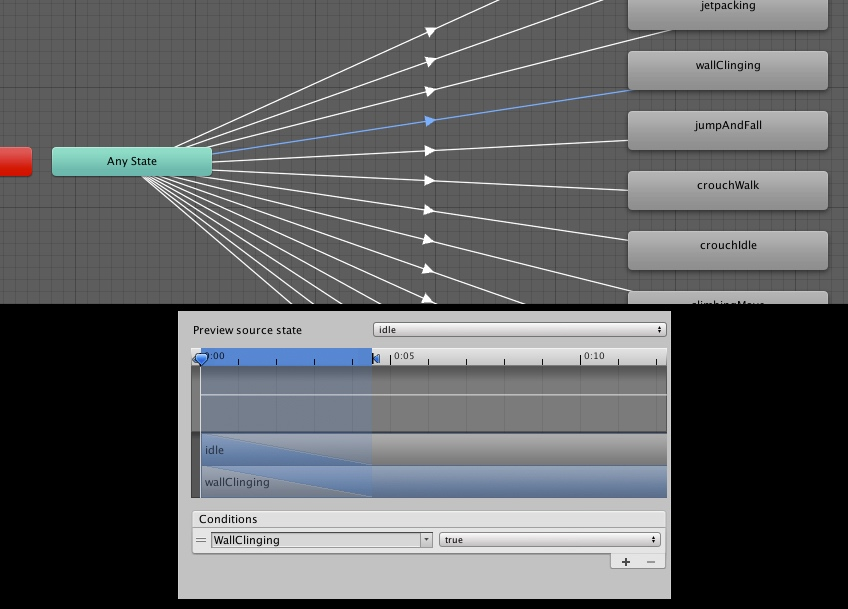

# 动画

> 这个页面讲解了在 Corgi Engine 中如何使用动画。

## 简介

Corgi Engine 包含了很多原型角色，它们都自带了大量的**动画（Animation）**。在各种 Demo 中，你会发现有些角色使用了**精灵图集（Sprite sheet）**，有的使用 **Mecanim 动画系统**，或者 **Spine 骨骼动画**，或者 **3D 的 FBX 格式的动画模型**。你可以随心所欲地选择适合你的技能和需求的动画方式，不过 Corgi Engine 应该已经覆盖了任何你想要采用的方式了。

这个页面不会讲解所有关于如何创建动画的知识，Unity 官网上已经有[大量的文档](https://unity3d.com/cn/learn/tutorials/topics/animation)可供查阅。这里会讲解的是动画在 Corgi Engine 中的具体实现，以及它如何帮助你创建优美的动画角色。

## 动画控制器



大部分情况下，都需要有一个 **Animation Controller** 来设置动画。Corgi Engine 资源中包含了大量的 Animation Controller，我建议使用 `RectangleAnimator` 作为起点来创建自定义的 Animation Controller，由于它包含了所有的动画参数，所以你不需要再自己手动输入它们了。你可以简单地复制一个，然后把动画剪辑拖拽进去，替换原来属于 Rectangle 角色的那些就可以了。

角色的 Animator Controller 由两大部分组成：一部分是动画的参数（Animation Parameters），`Character` 和 `Character Abilities` 组件每帧都会更新它们，以映射角色的当前状态；另一部分是一个状态机（State Machine），你可以用它来定义每个动画在什么条件下会被播放，以及动画之间如何转换。



你会发现它的工作流程**非常简单**，由于大部分转换（Transition）都直接基于角色的当前状态，所以最困难的检验各种可能条件的部分，已经由引擎解决了。当然你也可以修改它来创建更加复杂的状态转换，如果那样的效果更好的话。

## 动画与脚本

Corgi Engine 的角色系统已经内建了动画操作接口，所以你不需要再花时间处理这些。每一种能力都已经加载了相应的动画参数。你可以使用 [Unity 内建的方法](https://docs.unity3d.com/Manual/AnimationParameters.html)或者由 Corgi Engine 提供的方法来更新动画参数。做法确实很简单，从任何一个能力中你只需重载两个方法。以喷气背包（Jetpack）能力为例，我们来看一下它是如何使用的吧。

**InitializeAnimatorParameters**：这个方法中注册了后面会使用到的参数，实际上它只是在检查了参数在 Animator Controller 中确实存在之后，把它放到一个列表中，以避免潜在的运行时错误。如果参数不存在，更新请求（Update Request）则不做任何事情，而不是触发错误。这种机制允许你在多个角色之间共用单一的 Animator，而不用将所有参数拷贝到所有 Animator Contoller 中。这个方法只在 `Initialization` 方法中被调用。

```csharp
protected override void InitializeAnimatorParameters()
{
	RegisterAnimatorParameter ("Jetpacking", AnimatorControllerParameterType.Bool);
}
```

**UpdateAnimator**：这个方法在每一帧中都会被调用，它会根据动画参数的当前值来更新 Animator 的参数。这个方法应该只包含对 `MMAnimator.UpdateAnimatorBool/Int/Trigger` 方法的调用。

```csharp
public override void UpdateAnimator()
{
MMAnimator.UpdateAnimatorBool(_animator,"Jetpacking",(_movement.CurrentState == CharacterStates.MovementStates.Jetpacking),_character._animatorParameters);
}
```

## 添加新的动画

添加一个**新的动画**，你只需要创建它，然后拖拽它到角色的 Animator Controller 中，再创建连接到它的转换（Transition）。如果新动画需要新的参数，确保将它们添加到 Animator Controller 的参数列表中，以及在脚本中使用以上提到的两个方法来注册和更新它们。

## 动画参数

以下是引擎中已存在的所有动画参数的详细列表：

| 参数名（Parameter Name） | 能力（Ability） | 类型（Type） | 作用（Role） |
| --- | --- | --- | --- |
| Grounded | Character | Boolean | 当角色与地面接触时为 true |
| Alive | Character | Boolean | 当角色活着时为 true |
| CollidingAbove | Character | Boolean | 当角色碰撞到上方的墙壁时为 true |
| CollidingBelow | Character | Boolean | 当角色碰撞到下方的墙壁时为 true |
| CollidingLeft | Character | Boolean | 当角色碰撞到它左边的墙壁时为 true |
| CollidingRight | Character | Boolean | 当角色碰撞到它右边的墙壁时为 true |
| Idle | Character | Boolean | 当角色处于闲置状态时为 true |
| Activating | CharacterButtonActivation | Boolean | 当角色激活某些东西时为 true |
| Crouching | CharacterCrouch | Boolean | 当角色蹲伏时为 true |
| Crawling | CharacterCrouch | Boolean | 当角色爬行时为 true |
| Dangling | CharacterDangling | Boolean | 当角色犹豫不决时为 true |
| Dashing | CharacterDashing | Boolean | 当角色冲撞时为 true |
| Diving | CharacterDive | Boolean | 当角色俯冲时为 true |
| Gripping | CharacterGrip | Boolean | 当角色抓握某些东西时为 true |
| Speed | CharacterHorizontalMovement | Float | 角色当前的水平速度 |
| xSpeed | Character | Float | 角色当前的水平速度 |
| ySpeed | Character | Float | 角色当前的竖直速度 |
| Walking | CharacterHorizontalMovement | Boolean | 当角色走路时为 true |
| Jetpacking | CharacterJetpack | Boolean | 当角色使用喷气背包时为 true |
| Jumping | CharacterJump | Boolean | 当角色跳跃时为 true |
| DoubleJumping | CharacterJump | Boolean | 当角色进行双段跳跃时为 true |
| HitTheGround | CharacterJump | Boolean | 如果这一帧角色刚好碰到地面则为 true |
| LadderClimbing | CharacterLadder | Boolean | 当角色爬梯子时为 true |
| LadderClimbingSpeedX | CharacterLadder | Float | 当角色在梯子上时的水平速度 |
| LadderClimbingSpeedY | CharacterLadder | Float | 当角色在梯子上时的竖直速度 |
| LookingUp | Character | Boolean | 当角色向上看时为 true |
| Running | CharacterRun | Boolean | 当角色跑动时为 true |
| WallClinging | CharacterWallClinging | Boolean | 当角色附着在墙壁上时为 true |
| WallJumping | CharacterWallJump | Boolean | 当角色从墙壁上跳跃时为 true |

除此之外，在 `CharacterHandleWeapon` 组件中你也会发现许多动画参数，在每个武器的 Inspector 视窗中你可以直接设置它们的名称。

## Spine

如果你想要使用 Spine，可以尝试以下两种方法：

......

// TODO: 本小节内容暂未翻译

-------

[本页面的 Corgi Engine 官方英文原版链接](http://corgi-engine-docs.moremountains.com/animations.html)

# Animations

> **Summary:** This page describes how animations are used in the Corgi Engine.

## Introduction

The Corgi Engine includes a lot of demo characters, and they all come with a number of **animations**. In the various demos, you’ll find some characters animated using **spritesheets**, some using **Mecanim**, **Spine**, or **3D** fbx animated models. It’s really up to you to choose the animation method that fits your skills and needs. But the Engine should have you covered whatever method you decide on.

This page won’t cover how to create your animations. Unity has a lot of documentation on that, [go check it out](https://unity3d.com/cn/learn/tutorials/topics/animation). It will however cover the specifics of the Corgi Engine and how it’ll help you create nice animated characters.

## Animation Controllers


In most cases you’ll need an **Animation Controller** to setup your animations. The asset includes a bunch of these, I’d recommend using the RectangleAnimator one as a starting point for yours as it includes all animation parameters, so you won’t have to enter them all again. You can simply duplicate it, and then drag your animations into it, replacing the Rectangle ones as you go.

The Animation Controller is made of two big parts : on one side Animation Parameters that will get updated every frame by the Character and Character Abilities scripts to reflect the current state of the character, and on the other a state machine that will allow you to determine in which conditions each animation should be played and how to transition from one to the other.


You’ll notice it’s **very simple** in terms of workflow, as most transitions are simply based on the current character’s state, so the hard work of checking the many possible conditions is already done by the engine. Of course you can divert from that and have more complex transitions if that works better for you.

## Animation and scripts

The Corgi Engine’s character system has animation interfaces built-in so you don’t lose time on that. Every ability comes already loaded with corresponding animation parameters. To update animation parameters, you can either use [Unity’s built-in methods](https://docs.unity3d.com/Manual/AnimationParameters.html) or the ones provided with the Corgi Engine. It’s really quite simple, as from any ability you only need to override two methods. Let’s have a look at how it’s used in the Jetpack ability :

**InitializeAnimatorParameters** : This method “registers” parameters, for later use. Basically it just adds that parameter to a list, after having checked its existence in the Animation Controller, to avoid potential errors at runtime. If that parameter doesn’t exist, update requests will simply do nothing, without triggering errors. This allows you to share a single animator amongst many characters, without having to copy all parameters into all the controllers. This method is only called at Initialization.

```csharp
protected override void InitializeAnimatorParameters()
{
	RegisterAnimatorParameter ("Jetpacking", AnimatorControllerParameterType.Bool);
}
```

**UpdateAnimator** : This method, called every frame, will update the animator parameters with their current value. In it you should only have calls to MMAnimator.UpdateAnimatorBool/Int/Trigger.

```csharp
public override void UpdateAnimator()
{
MMAnimator.UpdateAnimatorBool(_animator,"Jetpacking",(_movement.CurrentState == CharacterStates.MovementStates.Jetpacking),_character._animatorParameters);
}
```

## Adding new animations

To add a **new animation**, all you have to do is create it, drag it into your character’s animation controller, and create a transition to it. If it requires new animation parameters, make sure you add them both to your animation controller’s parameters list and register/update them in your script(s) using the above methods.

## Animation Parameters

Here’s a full list of all the animation parameters already in the engine:

| Parameter Name | Ability | Type | Role |
| --- | --- | --- | --- |
| Grounded | Character | Boolean | True if the character is touching the ground |
| Alive | Character | Boolean | True if the character is currently alive |
| CollidingAbove | Character | Boolean | True if the character is colliding with a wall above |
| CollidingBelow | Character | Boolean | True if the character is colliding with a wall below |
| CollidingLeft | Character | Boolean | True if the character is colliding with a wall on its left |
| CollidingRight | Character | Boolean | True if the character is colliding with a wall on its right |
| Idle | Character | Boolean | n	True if the character is currently idle |
| Activating | CharacterButtonActivation | Boolean | True if the character is currently activating something |
| Crouching | CharacterCrouch | Boolean | True if the character is currently crouching |
| Crawling | CharacterCrouch | Boolean | True if the character is currently crawling |
| Dangling | CharacterDangling | Boolean | True if the character is currently dangling |
| Dashing | CharacterDashing | Boolean | True if the character is currently dashing |
| Diving | CharacterDive | Boolean | True if the character is currently diving |
| Gripping | CharacterGrip | Boolean | True if the character is currently gripping to something |
| Speed | CharacterHorizontalMovement | Float | The current horizontal speed of the character |
| xSpeed | Character | Float | The current horizontal speed of the character |
| ySpeed | Character | Float | The current vertical speed of the character |
| Walking | CharacterHorizontalMovement | Boolean | True if the character is currently walking |
| Jetpacking | CharacterJetpack | Boolean | True if the character is currently jetpacking |
| Jumping | CharacterJump | Boolean | True if the character is currently jumping |
| DoubleJumping | CharacterJump | Boolean | True if the character is currently double jumping |
| HitTheGround | CharacterJump | Boolean | True if the character just hit the ground this frame |
| LadderClimbing | CharacterLadder | Boolean | True if the character is currently climbing a ladder |
| LadderClimbingSpeedX | CharacterLadder | Float | The horizontal speed of the character if he’s on a ladder |
| LadderClimbingSpeedY | CharacterLadder | Float | The vertical speed of the character if he’s on a ladder |
| LookingUp | Character | Boolean | True if the character is currently looking up |
| Running | CharacterRun | Boolean | True if the character is currently running |
| WallClinging | CharacterWallClinging | Boolean | True if the character is currently clinging to a wall |
| WallJumping | CharacterWallJump | Boolean | True if the character is currently jumping from a wall |

In addition to that, you’ll find a number of animation parameters in CharacterHandleWeapon whose name you can set from the inspector of each weapon directly.

## Spine

If you want to use Spine, there are two ways you can go :

You can “**bake**” your character via the Spine Unity runtime. All the demo playable characters included in the asset use this method, but **I wouldn’t recommend it** for your game. The demo characters are baked because that was the only way to include them without having to add the Spine runtimes. These can’t be distributed by anyone else but Spine, so that was not possible. But baking Spine characters prevents you from using all the cool Spine features.

The “**best**” way to do is to create/animate your character in Spine, then do File > Export, select .json extension and format, check “create atlas”, go to parameters, set the atlas extension to .atlas.txt, tweak the other settings according to your character, and then export to a folder inside your project. This will create a bunch of Spine related files. You’ll then want to select the SkeletonData file, and drag it into a scene. Select the **SkeletonAnimator** option, and you should see your character on the scene. If that’s not the case, you probably need to select a skin from that new object’s inspector. While you’re at it, select the sorting layer of your choice (Player is the recommended one). You can now drag that object into your hierarchy to create a prefab.

Now there are two things left to do : add your Character’s components ([see this page for more](http://corgi-engine-docs.moremountains.com/how-to-create-character.html)), and take care of the animator. Spine animators work exactly like regular ones. Select your Character, and go to Window > Animator. There you should see an empty state machine. Start by adding the animation parameters you’ll need from the list above (Idle, Crawling, Crouching, etc…). Then, from the folder with all the exported Spine files, unfold the Controller animator, and drag and drop the required animations into your Animator. The only thing left to do is to create transitions to all these states, and that’s done exactly like for regular animation controllers (see higher in this page).

-------

