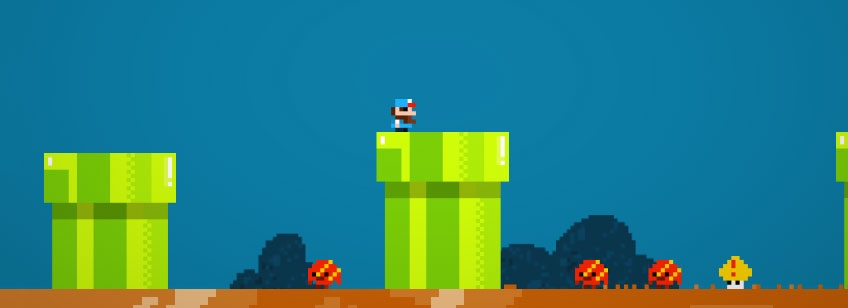

# 人工智能

[Artificial Intelligence](http://corgi-engine-docs.moremountains.com/ai.html)

> 这个页面讲解了 Corgi Engine 的 AI 脚本如何运作。

## 简介

目前 Corgi Engine 中包含了一些适用于敌人（或盟友）的**基础 AI 脚本**。你可以向角色添加这些组件（简单地通过角色的 Inspector 视窗底部的 AddComponent 按钮），它就会让角色执行动作**而不需要通过玩家输入**。你需要正确地设置角色，至少为每个 AI 脚本配备必要的组件才能使用它们。每个 AI 脚本可能要求某些特定的能力（Ability），但它们都要求角色上带有 `CorgiController` 组件和 `Character` 组件。你也可以联合它们，比如可以为角色添加 `AI ShootOnSight` 和 `AI Walk` 组件，这样它就能够到处走动并且射击玩家了。**更多的 AI 脚本即将发布**，以帮助你创建更多样化的敌人，不过你随时可以创建自定义的 AI 脚本，这确实很简单而且充满乐趣。

## AI ShootOnSight

这个组件需要一个 `CharacterHandleWeapon` 组件。它所做的就是向它的左右两边发射射线，定位你在它的 Inspector 视窗中指定的图层（layer）上的目标。如果有物体被这些射线击中，AI 就会用它当前装备的武器来射击它。

## AI Walk

这个组件需要一个 `CharacterHorizontalMovement` 组件。它让你的 AI 角色能够走动。你可以在它的 Inspector 视窗中指定它所需的行为。据此你可以让它巡逻（随机的走动，并且当碰到墙壁或者坑洞时改变方向），或者锁定目标的走动（walk on sight），也就是说 AI 会搜寻（使用射线）你在它的 Inspector 视窗中指定的图层（layer）上的对象。如果射线击中了这样的对象，角色就会向它移动过去。

## Ai Follow

这个组件需要一个 `CharacterHorizontalMovement` 组件。向角色添加这个组件会让它追随（或者试着追随）主要玩家角色。如果它带有 `CharacterRun` 组件，在它远离目标的时候它会尝试奔跑。如果它带有 `CharacterJetpack` 组件，它会尝试使用喷气背包来越过障碍物来靠近目标。而如果它带有 `CharacterJump` 组件，它会尝试跳过障碍物。

-------

