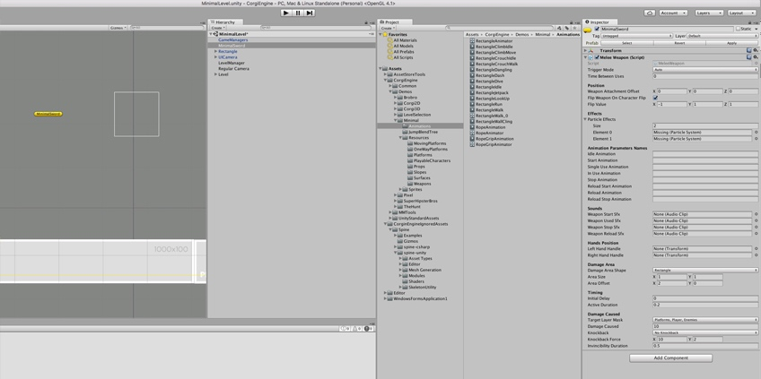
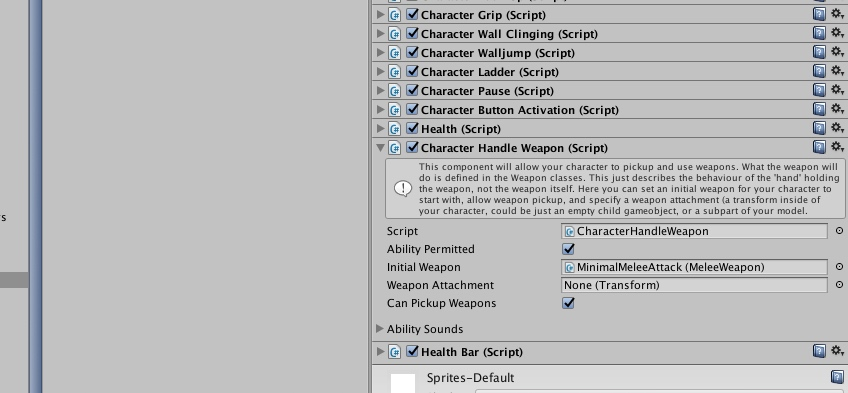
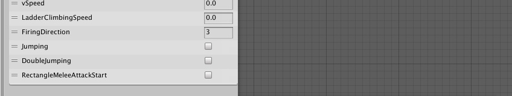
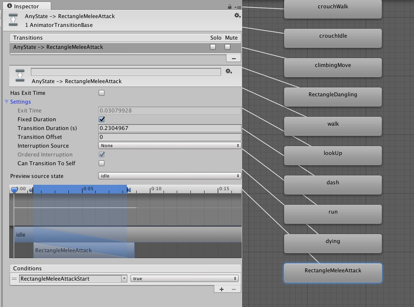
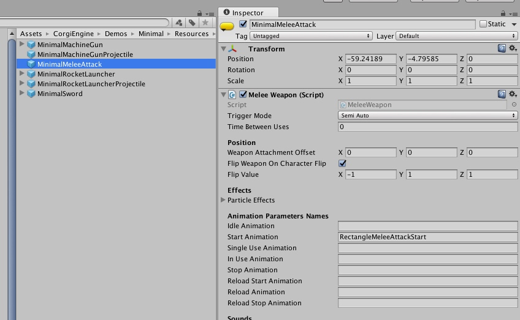
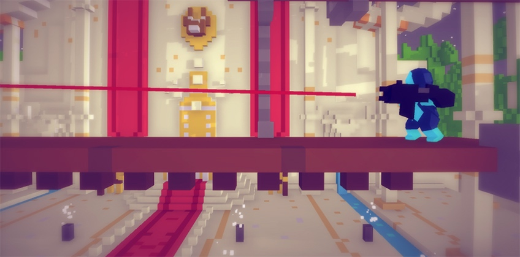

# 武器

[Weapons](http://corgi-engine-docs.moremountains.com/weapons.html)

> 这个页面讲解了 Corgi Engine 的武器系统背后的机制，以及如何创建和使用自定义的武器。

## 简介

Corgi Engine 包含了一个**通用的武器系统**，让你的角色可以装备武器（基于弹射的、近战的，或者任何你可以想到的），可以切换和使用武器。引擎也包含了一些武器的例子，你可以看一看，在创建自定义的武器时也可以用它们作为基础。

## CharacterHandleWeapon 能力组件

为了装备和使用武器，角色必须带有一个 **CharacterHandleWeapon** 组件。在它的 Inspector 视窗中，你可以可选地设定角色的初始武器，设定是否可以捡起新的武器，以及指定一个武器附着点（**Weapon Attachment**）。武器附着点是角色身上（或者嵌套在它的 Prefab 中）的一个 `Transform`，让武器可以贴附在上面。如果你没有指定它，武器将会贴附到角色 Prefab 的顶层（root level）。

**CharacterHandleWeapon** 组件接下来将会检测使用武器按键的变动，如果它被按下或松开，则把信息传递到角色当前装备的武器上。

## Weapon 类

Corgi Engine 中的所有武器都继承自 **Weapon** 类，当然也可以脱离它来创建武器，但引擎中所有的例子都是这么运作的。`Weapon` 类的目标是可以被扩展，并且定义了许多对于所有或大部分武器来说都共用的东西。用它作为基础，你可以创建一切，从霰弹猎枪到火箭筒，甚至一把武士刀或者一把擒拿枪。除了为动画、声音和状态管理提供坚实的基础，它还让你可以在子类中定义使用武器时会发生什么，并且从那里开始构建武器。作为示例，你可以查看弹射武器 **ProjectileWeapon** 和近战武器 **MeleeWeapon** 类，了解如何从这个完全相同的脚本创建出非常不同的武器。

## 创建一个武器

要创建自定义的武器，你可以重用 `ProjectileWeapon` 和 `MeleeWeapon` 脚本，扩展它们，或者创建自定义的 Weapon 子类。无论如何，你都需要**创建一个武器 Prefab**。为此，你需要一个 GameObject。最基本的，你可以选择创建一个可见的武器或者一个不可见的武器。例如，如果你看一下 `BlueRobot` 敌人角色，会发现它们确实有武器，但你看不见它，它只是一个产生特效和子弹的空 GameObject。反之，`MinimalRocketLauncher` 是可见的，它甚至有两只小手（非常小）。这样当玩家的目标旋转时，武器总是面向正确的方向。所以这些抉择都取决于你想要达到的视觉效果。

一旦你有了 Sprite、Model 或者空的 GameObject，只需要为它添加一个 Weapon 脚本（ProjectileWeapon，MeleeWeapon，或者自定义的脚本）。在它的 Inspector 视窗中你可以设定它开火时触发的动画、声音和特效，以及指定当角色翻转时武器应该如何翻转。

以下是如何一步步创建一个近战武器的参考：

* 创建一个空的 GameObject。
* 为它添加一个 `MeleeWeapon` 组件。

* 在 `MeleeWeapon` 的 Inspector 视窗中，设置如下参数：`Trigger Mode` 设置为 `Semi auto`，`Damage Area Shape` 设置为 `Rectangle`，`Area Size` 设置为 `{1,1}`，`Area Offset` 设置为 `{2,0}`（所以杀伤区域会在角色的前面激活），`Active Duration` 设置为 `0.2` （这是一个短暂的攻击，例如最基本的打出一拳）。然后设置 `Target Layer Mask` 为 `Platforms` 和 `Enemies`，`Damage Caused` 为 `10`。 
* 重命名这个 GameObject 为 `MeleeAttackWeapon`（或者任何你喜欢的）。
* 把这个 GameObject 拖拽到 Hierarchy 视窗中，以此创建一个 Prefab。
* 选择角色，然后拖拽这个新建的 Prefab 到 `Initial Weapon` 属性槽中（或者也可以通过使用脚本中的 `ChangeWeapon` 方法来装备它）。

* 就这样，现在你已经有一个可以工作的武器了。按下 `Play`，然后按下 `E` 键（默认），你就可以向周围发起攻击且对敌人或物体造成伤害。但目前为止你在攻击的时候可能还看不到任何效果，所以让我们为攻击绑定一个动画效果。
* 选中角色的 Animator，拖拽攻击动画到它的窗口中，如果攻击动画还没被添加的话。
* 创建一个新的动画参数（点击 Parameters 面板右上角的 + 按钮），在这个例子中我们将它命名为 `RectangleMeleeAttackStart`。

* 创建一个到该动画的转换（Transition）。你可能需要对它做如下设置（至少要勾选 `Fixed Duration`），但也可以随意调整以适应特定的动画。

* 回到武器的 Inspector 视窗，然后在 `Start Animation` 字段填上动画参数名，在这个例子中是 `RectangleMeleeAttackStart`。

* 再次按下 `Play`，然后用你的武器来攻击，现在你可以看到角色的攻击了。你也可以为攻击中、攻击结束等状态添加其他动画。

## 定时（Timing）

创建武器的时候，定时（Timing）是必不可少的，因为你需要让武器组件和它的动画完美地同步。所有武器都带有以下两个变量，你可以在武器的 Inspector 视窗中调整：

* **DelayBeforeUse**：从接收到输入到实际调用 `WeaponUse` 方法的时间间隔，例如开枪、抛掷出斧头等。
* **TimeBetweenUses**：连续两次调用 `WeaponUse` 方法的时间间隔（无论是在自动模式，还是通过连续按下按键），武器在此间隔期间不会「发射」。

另外，近战武器还有两个可以使用的变量：

* **InitialDelay**：`WeaponUse` 方法被调用和杀伤区域（Damage Area）被激活之间的延迟。
* **ActiveDuration**：杀伤区域保持激活状态的时间间隔。

最后这两个参数是杀伤区域所特有的，当然，你需要将这些值和 `DelayBeforeUse`/`TimeBetweenUses` 变量的值做同步以避免冲突。

## 武器激光瞄准器

你可以为武器添加一个 **WeaponLaserSight** 组件，它当然更适用于弹射式的武器，但这并**没有限制**。它会在武器的前面发射一道激光，就像激光瞄准器那样。你可以设置 `Laser Collision Mask` 变量，于是当它碰到墙壁或者平台的时候会停下来。在它的 Inspector 视窗中你也可以定制激光的外观。

-------

