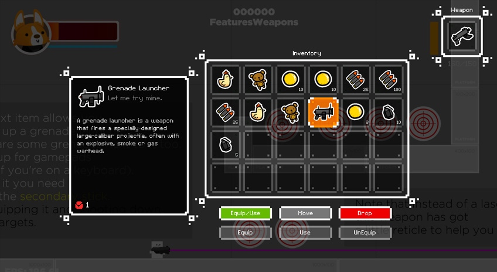

# 装备

[Inventory](http://corgi-engine-docs.moremountains.com/inventory.html)

> 这个页面讲解了如何为游戏添加装备系统。

##  The Inventory Engine

从 v4.0 版本开始，Corgi Engine 包含了一个**装备引擎（Inventory Engine）**，More Mountain 出品的独立完整的装备解决方案。同时它还打包了 2 个 Demo 场景和一些可用的物品，所以你并不需要担心将它嵌入到另一个项目中，它已经为你的使用做好了设置。

Inventory Engine 的设计旨在简单而灵活，如果你想使用它，建议你阅读它的[专用文档](http://inventory-engine-docs.moremountains.com/)。

## Corgi Engine 的相关细节

Corgi Engine 还包含了一些额外的特性来帮助无缝地使用 Inventory Engine：

* **CharacterInventory**：一种新的能力（Ability），允许你绑定 3 个装备到你的角色上。你只需要在 Main、Weapon 和 Hotbar Inventory 中填写装备的名字，剩下的引擎会帮你搞定。

* **FeaturesInventory** 和 **FeaturesWeapons**：2 个专注于装备特性的 Demo 场景，比如捡起物品、装备武器、使用兴奋剂等。能够看到这两个引擎结合的可能性是很棒的。

-------

