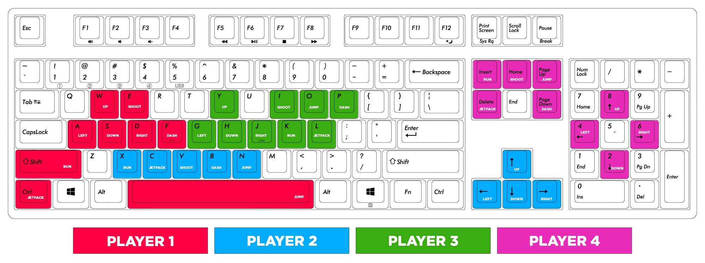
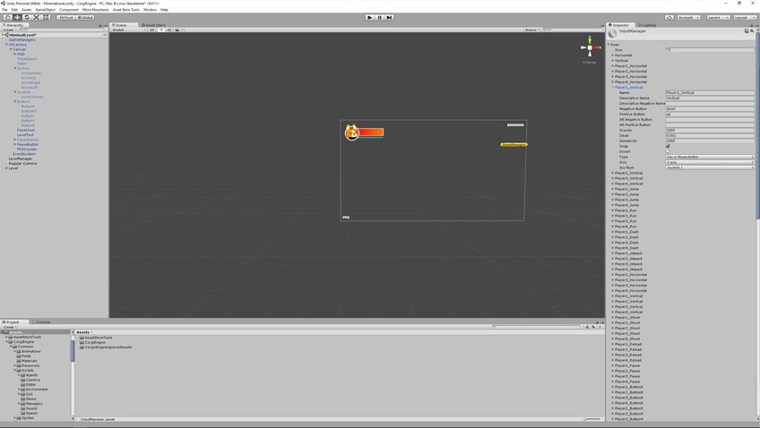
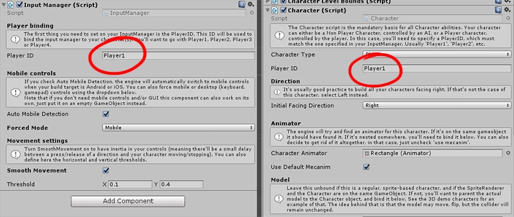
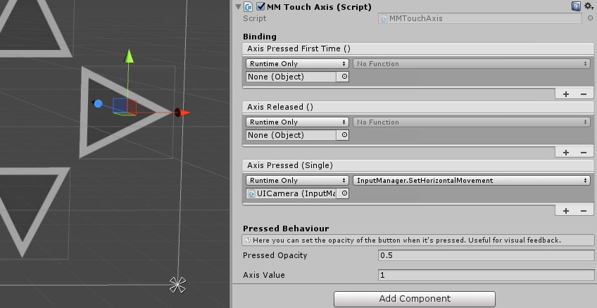

# 输入

> 这个页面说明了如何在你的游戏中设置输入。

## 简介

输入是所有游戏的核心，在 Corgi Engine 中也不例外。引擎当前支持移动设备操控（iOS、Android...）、键盘、游戏手柄（初始设置为 Windows Xbox 手柄，但可以重新绑定为其他控制器的键位）以及鼠标。

## 默认输入

默认的键盘布局被设置为同时支持 4 位玩家。目前对于单玩家游戏来说，这个键位可能并不是特别舒服，请按照你的需求任意重新映射这些按键。不管怎样，这是默认布局：

## 输入设置：如何更改键位绑定？

对于键盘和游戏手柄（以及较少程度上的鼠标），键位绑定就像在任何优秀的 Unity 项目中一样，**通过原生的 Input 设置**进行设定。你可以通过顶部菜单 `Edit > Project Settings > Input` 来访问这些设置，这样应该可以打开一个很长的 Axes 列表。如果你之前没有了解过这个面板，可能需要[先阅读一下官方文档](https://docs.unity3d.com/Manual/class-InputManager.html)。

目前这个列表相当长，为了支持 4 个玩家而被填满（你想要的话还可以添加更多），并且可以说是一个关键的配置。你可以任意地**编辑这些配置**，根据你的偏好重新绑定键位。

## Input Manager 与 GUI

通常使用**输入（Input）**来移动屏幕上的角色，无论是通过触摸屏幕还是按下机械按键。Corgi Engine 用 Input Manager 组件来处理输入检测并将其传递给角色。Corgi Engine 的大部分关卡都有一个 UICamera 对象。这个 UICamera Prefab 也有一堆移动控制相关的东西，用来在移动设备上控制玩家角色。为此，同时为了让绑定更加简单，你会发现 InputManager 组件放置在 UICamera Prefab 的顶层。你愿意的话也可以将它放置在单独的 GameObject 上。

`InputManager` 是一个很长的类，不过如果你细看一下就会发现它并不复杂，只是非常琐碎。它有很多让你能够绑定移动设备控制的方法，以及为每一个登记的按键管理一个小状态机。

在它的 Inspector 视窗你可以指定 **Player ID**（阅读下一小节以了解详细信息），无论你使用的是移动设备检测还是强制使用移动设备控制。你也可以决定使用虚拟方向键/十字键或者虚拟操纵杆。最后你可以设置平滑运动的开关（当按下按键时是应该即时移动还是要快速的线性插值？），还有水平和竖直方向的阈值。

## Player ID

这里要理解的一个重要概念就是 **Player ID**。引擎能够从 InputManager 获得输入然后发送给场景中的玩家角色（带有 `Character` 组件且类型设置为 `Player` 的对象）。每一个 InputManager 都有一个 `Player ID` 属性，它会将它的信息发送给所有匹配上 `Player ID` 属性的角色。所以有一些方法可以让它工作：

* 最普遍的方法是**交给引擎来处理**。添加一个 InputManager 组件到场景中，设置它的 `Player ID` 为 `Player1`。然后在 LevelManager 对象的 Inspector 视窗中，当你添加完角色后（在 Player Prefabs 设置项下面），勾选 `Auto Attribute Player IDs`，接着它就会自动标识玩家角色的 ID 为 `Player1`。如果在一个多玩家关卡中，则会使用 `Player2`、`Player3` 和 `Player4`。当然你也可以添加自定义的 `Player ID`，但以上这些是默认的。
* 你也可以**在 Prefab 上**设置 `Player ID`。例如有一个 Dog 角色，它的 `Player ID` 是 `JoeTheDog`。如果你添加了一个 InputManager 到场景中，并且想设置它的目标为这个 Dog 角色，那么设置它的 `Player ID` 参数为 `JoeTheDog` 即可。按下 Play 按钮，应当就可以控制你的 Dog 角色了。如果由于某些原因你不想使用 LevelManager，又想马上移动场景中的 Prefab 时，使用这种方法就非常好。

当调整一个角色的时候，我更多地使用第二种方法。例如我想要修改角色上的跳跃行为，我只需要拷贝该角色的 Prefab，把这个拷贝放到场景中，并且设置它的 `Player ID` 为 `Player1`。然后在 LevelManager 中，将原始的 Prefab 设置为关卡的 Player Prefab。按下 Play 按钮，现在我就可以使用同样的输入控制两个角色（调整前和调整后的）啦。接下来我可以更改其中一个的跳跃设置（甚至用一个新的跳跃脚本替换掉旧的），快速地测试这两个角色，看看这些更改是否提升了游戏体验。

## 平台检测是如何工作的？

在 InputManager 组件的 Inspector 视窗中，你可以开启或关闭 **Auto Mobile Detection**。

如果你展开 UICamera Prefab，会发现它包含了很多东西，最明显的就是方向键（Arrows）、操纵杆（Joystick）和按键（Buttons）这几个画布分组（Canvas Groups）。它们**默认为不可用（Disable）**，以适应更简单的关卡，但你也可以开启或者调整它们。这些（以及其他东西）都是在 GUIManager 组件中绑定的。移动设备检测的工作方式很简单：如果你的目标是移动设备平台（iOS 或者 Android），当你按下 Play 按钮的时候这些操纵组件会显示出来；如果你的目标是其他平台，它们就会**隐藏且变为不可用**。通过 Inspector 视窗，你可以强制设置为任何一种模式。

## 虚拟方向键、操纵杆和按钮

Corgi Engine 资源中包含了完整功能的十字方向键、操纵杆和一些按钮，当然你也可以将它们混合搭配使用，添加新的按钮、操纵杆等等，以适配你的游戏玩法。

**移动方向键（Mobile Arrows）**非常简单，只需要将一个 `MMTouchAxis` 组件放置在一个 Rect+CanvasGroup 对象上。接着在它的 Inspector 视窗中设置 `Axis Value`（通常对于左/下为 `-1`，对于右/上为 `1`），然后将它的` Axis Pressed` 事件绑定到 InputManager。操作方法是，拖拽 InputManager（大部分情况下在场景的 UICamera 对象下）到 `Runtime Only` 下方的小方框中，然后选择适当的方法（`SetVerticalMovement`、`SetHorizontalMovement` 或者对应 Secondary 方法）。

**移动操纵杆（Mobile Joysticks）**甚至更容易设置。只需要添加一个 `MMTouchAxis` 组件到一个 Rect+CanvasGroup 对象上，设定哪个轴是可用的（比如你只想要一个水平方向的操纵杆），`Max Range`（球形柄离原始位置的最大距离），最后再绑定到 InputManager。注意你还需要指定一个目标摄像头（`Target Camera`，通常是场景中的 UICamera）。

**按钮（Buttons）**的工作方式也一样，但你可以为它们指定 3 种不同的事件：`Button Down`（当它第一次被按下时），`Button Up`（但它被松开时），以及 `Button Pressed`（当它在某一帧被按下时）。这样你就可以在某个按钮松开时让你的 Character Ability 组件（举个例子）调用某个方法了。你不需要绑定所有事件，如果你没有全用到它们的话。

## Nice Touch

Corgi Engine 包含了另一个由 More Mountains 出品的插件：[Nice Touch](https://www.assetstore.unity3d.com/cn/#!/content/65358)。如果你已经有了 Corgi Engine 就不用再买它了！我创建 Nice Touch 是为了提供一个简单快速的输入解决方案。它负责处理键盘、游戏手柄和触摸屏幕输入。除此之外还有很多其他的输入解决方案。有一段时间 Corgi Engine 使用的是 Unity 的标准资源中的 `CrossPlatformInput` 组件。创建 Nice Touch/MMControls 是为了提供一个更简单的替代品，更快捷的设置，而除去那些不必要的设置。你也可以用回自己的组件而不一定要使用这些。

你可以在路径 `MMTools/MMControls` 下找到这些脚本，在同一个目录底下还包含了一个测试场景：MMControlsTestScene。你需要在你的游戏中保持这个目录。

-------

[本页面的 Corgi Engine 官方英文原版链接](http://corgi-engine-docs.moremountains.com/input.html)

# Input

> **Summary:** This page explains how to setup input in your game.

## Introduction

Input is at the heart of every game. The Corgi Engine is no exception. It currently supports mobile controls (iOS, Android…), keyboard, gamepad (setup for windows xbox pad but feel free to rebind the keys for other controllers), and mouse.

## Default Input

By default the keyboard layout has been created to support 4 simultaneous players. Now that may not be very comfortable for a single player game, feel free to remap the buttons to suit your needs (see the following section). In any case, here is the default layout (click on the image to expand) :

## Input Settings - How to change key bindings?

For keyboard and gamepad (and to a lesser extent mouse), key bindings are defined, like in any good Unity project, **via the native Input settings**. You can access these via the top menu Edit > Project Settings > Input. This should open a quite large list of “axis”. If you’ve never seen this panel before, maybe [have a look at the official documentation first](https://docs.unity3d.com/Manual/class-InputManager.html).

Now that list is pretty long. That list has been filled to support 4 players (you could add more if you want), and proposes one key configuration. Feel free to **edit each of these** to rebind the keys to your preference.

## Input Manager and GUI

To move your character on screen, you usually use **input**, whether it’s via touch on a screen or by pressing mechanical keys. To handle input detection and pass it to your Character, the Corgi Engine uses an Input Manager. Most levels of the Corgi Engine have a UI Camera in them. This UI Camera prefab also has, nested inside it, a bunch of mobile controls used to control the player when playing on mobile. For that reason, and to make binding easier, you’ll find the InputManager at the top level of the UICamera prefab. You can decide to place it on its own game object if you prefer.

The Input Manager is quite a long class. If you take a look at it, you’ll see it’s **not too complex**, just very verbose. It has a lot of methods that you’ll be able to bind to your mobile controls, and manages a small state machine for each of the registered buttons.

From its inspector you’ll be able to specify the **PlayerID** (see the next section for more on that), whether or not you want to use mobile detection or force mobile controls. You can also decide whether you prefer virtual arrows/dpad or virtual joystick. And finally you can set smooth movement on or off (should a press on left be instant or quickly lerped?), and the horizontal and vertical thresholds.

## Player ID

One thing here that is **really important** to understand is the **PlayerID** notion. The engine is able to send input from the InputManager to playable characters in the scene (objects with a Character component whose type is set to Player). Each InputManager has a PlayerID attribute, and it’ll send its information **to all characters whose own PlayerID attribute match it**. So there are a few ways this can work :

* The most common way is to simply **let the engine handle this**. Add an InputManager to your scene, set its PlayerID to “Player1”. Then in the LevelManager, when you add your character, have the “**Auto attribute player IDs**” checkbox checked, and it’ll automatically give the playable character the “Player1” ID. If you are in a multiplayer level use “Player2”, “Player3” and “Player4”. You can add your own of course, but these are the default ones.
* You can also set the PlayerID **on the prefab**. For example you could have a Dog character, whose PlayerID is “JoeTheDog” (why not?). If you add an InputManager to your scene and want it to target that Dog character, set its own PlayerID parameter to “JoeTheDog”. Press play and you should be able to control your Dog character. That method is great if for some reason you don’t want to use the Level Manager and want to instantly move a prefab in the scene.

I use that second method a lot **when tweaking a character**. Let’s say I want to change the Jump behaviour of my character. I’ll just copy my character’s prefab, put that copy in the scene, set its PlayerID to Player1. Then in the LevelManager I put the original prefab as the Player Prefab. I press play and I’m now controlling two characters with the same input. I can then change the jump settings on one of them (or even add a new Jump script in place of the old one), and **play test both very fast** to see if my changes are improving the gameplay.

## How does platform detection work?

From the InputManager’s inspector you can turn **auto mobile detection** on or off.

If you unfold the UICamera prefab, you’ll see it contains quite a lot of stuff, and notably Arrows, Joystick and Buttons canvas groups. They’re **disabled by default** to allow for simpler level editions but you can turn them on if you prefer, or to tweak them. These are then bound to the GUIManager component (among other stuff). Mobile detection works in a very simple way : if you’re targeting a mobile platform (iOS or Android), it’ll show the controls when you press play. If you’re targeting another platform, it’ll **hide and disable them**. You can also force one mode or the other from the inspector.

## Virtual Arrows, Joysticks and Buttons

The asset comes packed with a fully functional arrow D-pad, a joystick and some buttons, but of course **you can remix all that**, add buttons, add joysticks, etc. to match your own gameplay.

**Mobile arrows** are very simple, you just need an MMTouchAxis component on a Rect+CanvasGroup object. Then in its inspector you need to set the axis value (usually -1 for left/down or 1 for right/up). Then you need to bind it to your InputManager, simply on the AxisPressed event. To do that, just drag your InputManager (in most cases the UICamera prefab in your scene) onto the little box below “runtime only”, and then select the appropriate method (SetVerticalMovement, SetHorizontalMovement, or their secondary counterparts).

**Mobile joysticks** are even easier to setup. Just add a MMTouchJoystick component to a Rect+CanvasGroup object, define which axis are enabled (you may want an horizontal only stick for example), the max range (how far the knob can move from its base), and then you bind your input manager to it. Note that you’ll also need to specify a target camera (usually your UICamera).

**Buttons** work in the same way too, but for them you’ll be able to specify three different events : button down (when it’s pressed for the first time), button up (when it’s released), and button pressed (when it’s being pressed at a certain frame). This will allow you in your Character Abilities (for example) to call certain methods when a button gets released for example. You don’t have to bind all events if you’re not using all of them.

## Nice Touch

The Corgi Engine includes another of More Mountains’ assets : [Nice Touch](https://www.assetstore.unity3d.com/en/#!/content/65358). **Don’t buy it if you already own the Corgi Engine!** I created Nice Touch to provide **a simple and fast input solution**. It handles keyboard, gamepad, mouse, and touch input. There are a lot of other input solutions out there. For a while the Corgi Engine used Unity’s standard assets’ CrossPlatformInput. Nice Touch/MMControls were created to give a simpler alternative, faster to setup, without unnecessary settings. Feel free to not use these and replace them with your own.

You’ll find these scripts into MMTools/MMControls. That same folder also includes a test scene : MMControlsTestScene. You’ll want to keep that folder in your game.

-------

