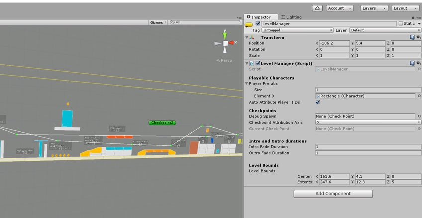
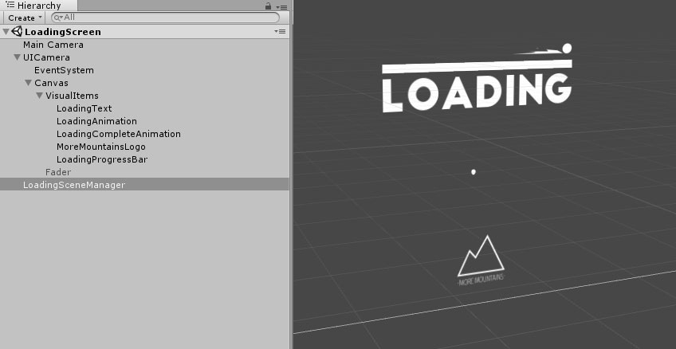

# Managers

> 这个页面讲解了 Corgi Engine 中包含的各种 Manager，以及如何根据你的需求来调整它们。

## 简介

Corgi Engine 使用 Manager 来作为大量类和组件的**核心引用点**。这些 Manager 会一直存在于你的场景中，它们会记录当前得分、播放中的声音，或者角色重生的位置。

其中，在大部分场景中，都会有 Game Manager、Level Manager、Input Manager 和 Sound Manager 一直存在着。通常要把它们放置在空的 GameObject 中。它们在场景中的位置无关紧要，反正它们是不可见的。一个好的习惯就是把它们放置在远离你的关卡物件的地方，以免不小心把它们给删了。

## Game Manager

**Game Manager** 是一个高层次的管理类，负责设置目标帧率、存储得分、处理时间比例（Timescale），以及记录玩家上一次在关卡地图中的位置。大多数情况下，你都**不需要跟它打交道**，只需要保证关卡中存在着一个 Game Manager 即可。如果你想了解更多详细信息，可以查阅 [API 文档](http://corgi-engine-docs.moremountains.com/API/)。

## Level Manager

Level Manager 是很多引擎脚本的引用点，它维护了一张游戏中玩家角色的列表（通常是一个玩家，但也可以有多个）。同时它还负责出生（Spawn）和重生（Respawn），以及记录点（Checkpoint）管理。

请留意还有一个 **Multiplayer Level Manager** 也起着类似的作用，但是针对多玩家关卡使用的。



大部分情况下，每个关卡都要有一个 **LevelManager**，它需要放置在单独的 GameObject 中。在它的 Inspector 视窗中你可以（也应当）设置将哪个 Prefab 作为玩家角色。做法是，首先展开 `Player Prefabs` 选项（如果它折叠起来的话），然后从 Project 视窗中拖拽一个 Prefab 到 `Element 0` 字段中。如果是多玩家关卡，则先设置 Player Prefabs 数组的 `Size` 大于 `1`，然后再重复以上过程。关于 `Auto Attribute Player IDs` 复选框，可以查阅 [Input 页面](https://github.com/Caizc/corgi-engine-docs/blob/master/3.General/3-2.%E8%BE%93%E5%85%A5.md)的内容。

你还可以设定一个 **Debug Spawn**（从场景视图中拖拽一个，或者点击字段右边的小圆点然后在打开的弹出窗口中选择一个）。这个调试出生点（Debug Spawn）是在编辑器模式（Editor Mode）下玩家角色出生的地方（在调试一个关卡最后部分的时候很有用）。

通过 LevelManager 的 Inspector 视窗你还可以设置**关卡的边界（Level Bounds）**。它们是关卡的边界，摄像头的范围不会超过它们，在大部分情况下角色也一样。要设置它，首先设置它的中心位置，然后更改边框的覆盖范围。你应该可以在 Scene 视图中看到这个黄色的边框。

## Input Manager

**Input Manager** 负责处理输入并且将指令发送给玩家角色。[Input 页面](https://github.com/Caizc/corgi-engine-docs/blob/master/3.General/3-2.%E8%BE%93%E5%85%A5.md)给出了更加详细的信息。

**这个脚本的执行顺序（Execution Order）必须是 -100**，以确保在每次 `Update()` 中都被优先执行，并且避免各种奇怪的副作用，特别是在低帧率的情况下。如果你把 Corgi Engine 导入到一个空的项目中，则应该已经设置好了。你可以通过**点击脚本文件**，然后点击位于脚本 Inspector 视窗右上方的 **Execution Order 按钮**来设定一个脚本的执行顺序。查阅[这个页面](https://docs.unity3d.com/Manual/class-ScriptExecution.html)了解更多细节。

## Sound Manager

顾名思义，**Sound Manager** 负责管理 Corgi Engine 中的声音播放。当然你也可以通过在代码中使用 Unity 的原生 API 来直接播放声音，但是使用 Sound Manager 可以确保所有声音播放都使用**同样的音量设置**，这样当声音被禁用时它们就不会被播放等等。它通常和 GameManager 脚本放置在同一个 Prefab 对象中。在它的 Inspector 视窗（或者代码）中，你可以设置背景音乐（Music）和音效（SFX）的音量，还有它们各自是否启用。你可以在 [API 文档](http://corgi-engine-docs.moremountains.com/API/)中查阅更多细节，不过你主要会用到以下方法：

* 播放一段背景音乐（会把之前任何播放中的背景音乐替换掉）：

```csharp
PlayBackgroundMusic(AudioSource Music);
```

* 播放一段音效。你可以为它指定一个空间位置，以及是否应该循环播放（这种情况下请记得停止它）：

```csharp
PlaySound(AudioClip sfx, Vector3 location, bool loop=false);
```

## Loading Scene Manager

在 Unity 中，通常当你想切换到另一个场景时（例如在一个菜单界面，或者从一个场景进入下一个），你会使用 **SceneManager API**，而且很可能是 `SceneManager.LoadScene()` 方法。Corgi Engine 有自己的切换场景的 API，不过你要是不喜欢的话完全可以**不用它**。我个人觉得 Unity 的方法没有为玩家提供视觉反馈，然而场景加载在诸如移动设备上需要耗费一段时间，所以只是显示一个黑屏看起来**并不美观**。



如果你想为玩家提供更好的体验，你可以使用 **Loading Scene Manager**：

* 它可以在**任何地方**被调用，所以你不需要在场景中放置一个 `LoadingSceneManager` 组件。
* 它负责处理加载（顾名思义），展示一段**动画（Animation）**和一个**进度条（Progress Bar）**。
* 它是完全**可定制的（Customizable）**，只要编辑路径 `Common/LoadingScreen` 场景中的内容。你可以轻易地加入自己的 logo，更改进度条的外观，以及播放的动画等。
* 使用它真的很**简单**。

想要在关卡切换的时候使用 LoadingSceneManager API，只需要调用 `LoadingSceneManager.LoadScene(string sceneToLoad)` 方法。传入其中的 string 参数当然必须与你要加载的场景名称**一致**。所以，如果你想加载最小多玩家 Demo 的话，你可以这样使用：

```csharp
LoadingSceneManager.LoadScene ("Minimal4Players");
```

然后剩下的就交给引擎来搞定吧。

## 扩展 Manager

如果基于某些原因你想要修改一个 Manager 的行为，最好的方式就是扩展它，这样当你更新插件的时候你就不会丢失已有的更改。扩展一个 Manager 相当简单，你只需要创建一个继承自要修改行为的 Manager 的新的类，就像这样：

```csharp
using UnityEngine;
using System.Collections;
using MoreMountains.Tools;
using System.Collections.Generic;

namespace MoreMountains.CorgiEngine
{
    public class NewGameManager : GameManager
	{
	   protected override void Start()
	   {
            base.Start();
            MMDebug.DebugLogTime("new game manager");
	   }
	   public override void Pause()
	   {
            base.Pause();
            MMDebug.DebugLogTime("new game manager pause");
	   }
	   public override void AddPoints(int pointsToAdd)
	   {
            base.AddPoints(pointsToAdd);
            MMDebug.DebugLogTime("new game manager add points");
	   }
	}
}
```

在这个例子中，一个新的 GameManager 被创建，并且一些方法被重载了。它们只是做了基类所做的事情，然后输出一条 Debug 信息。当然，你应该让它们做更多的事情。你只需要把新的 Manager 放置到场景中的一个对象上，然后移除掉它原来的基类（扩展前的 Manager 脚本）。

-------

[本页面的 Corgi Engine 官方英文原版链接](http://corgi-engine-docs.moremountains.com/managers.html)

# Managers

> **Summary:** This page covers the various managers included in the Corgi Engine and how to tweak them to your needs.

## Introduction

The **Corgi Engine** uses managers as **central reference points** for a lot of classes and components. These managers, **always present in your scene**, will remember the current points count, the sounds that are playing, or where to spawn the character.

There are a few of them, and in most scenes you’ll have a Game, Level, Input and Sound managers present at all time. Usually you’ll want to place them on empty gameobjects. Their position in your scene doesn’t matter, they’re invisible anyway. It’s good practice to put them out of the way of your level so you don’t delete them by accident.

## Game Manager

The **Game Manager** is a high level manager that is responsible for setting the target frame rate, storing the points, handling the timescale, and remembering where on the level map the player was last time. In most cases **you won’t have to interact with it**, but make sure there’s one in your levels. The API documentation is a good place to go to if you want more information about it.

## Level Manager

The **Level Manager** is a reference point for a lot of the engine’s scripts. It maintains a list of player characters in the game (usually one but you could have more if you want). It’s also in charge of spawn and respawn, and checkpoint management.

Note that there’s also a **Multiplayer Level Manager**, which does pretty much the same thing, but for multiplayer levels.


In most cases you’ll want a **LevelManager** in each of your levels. It needs to be on its own gameobject. From its inspector you can (and should) set what prefab to use as the player. To do so, unfold the PlayerPrefabs dropdown if it’s folded, and just drag a prefab from your project view into the Element0 field. If you’re in a multiplayer level, set the size of the PlayerPrefabs array to more than 1 and repeat the process. For more information about the “Auto Attribute Player ID” checkbox, [check out the Input page](http://corgi-engine-docs.moremountains.com/input.html).

You can also define a **debug spawn** (drag one from the scene view, or click on the little dot at the right of the field and select one from the popup window that will open). This debug spawn will be where your player will spawn while in editor mode (useful to tweak the end of a level for example).

The level manager’s inspector is also where you’ll be able to set the **level bounds**. They’re the limits of your level, your camera won’t go beyond that, and in most cases neither will your character. To set that up, just set the center’s position, and change the extends of the bounding box. You should see the bounding box in yellow in the scene view.

## Input Manager

The **Input Manager** handles the inputs and sends commands to the player. It’s described in more details [on the Input page](http://corgi-engine-docs.moremountains.com/input.html).

**This script’s Execution Order MUST be -100**, to make sure it always runs first on each Update(), and avoid weird side effects, especially at low framerates. If you’ve imported the engine into a blank project that should already be the case. You can define a script’s execution order by **clicking on the script’s file** and then clicking on the **Execution Order button** at the bottom right of the script’s inspector. See [this page](https://docs.unity3d.com/Manual/class-ScriptExecution.html) for more details.

## Sound Manager

As its name implies, the **Sound Manager** is in charge of playing sounds in the Corgi Engine. Of course you can play them directly in your code using Unity’s native APIs, but using the Sound Manager will ensure that it’s played using **the same volume settings** as other sounds, that they won’t be played if sound has been disabled, etc. It’s usually found on the same prefab as the GameManager script. From its inspector (or from your code), you’ll be able to set the music and sound effects (Sfx) volume, and whether or not each is active. You can have a look at the [API documentation](http://corgi-engine-docs.moremountains.com/API/) for details, but mostly you’ll be using the following methods :

**To play a background music** (will replace any previously playing background music) :

```csharp
PlayBackgroundMusic(AudioSource Music);
```

**To play a sound effect** - you can specify its position in space, and whether or not it should loop (make sure you stop it in this case) :

```csharp
PlaySound(AudioClip sfx, Vector3 location, bool loop=false);
```

## Loading Scene Manager

With Unity, usually when you want to go to another scene (in a menu, or to go from one level to the next for example), you’d use the **SceneManager API**, and probably the SceneManager.LoadScene() method. The engine comes with its own scene change API, that you’re completely free **not to use** if you don’t like it. Personnally I think that this method doesn’t provide visual feedback to the player, and scene loading on mobile for example can be a few seconds long, so just having a black screen there **isn’t really good looking**.


If you want to provide a better experience to your player, you can use the **Loading Scene Manager** :

* it can be called from **anywhere**, you don’t have to have a LoadingSceneManager in your scene
* it handles loading (as the name implies), showing an **animation** and a **progress bar**
* it’s completely **customizable**, just edit the Common/LoadingScene scene’s contents. You can easily add your own logo, change the look of the progress bar, what animation is playing, etc.
* it’s pretty **simple** to use

To use the LoadingSceneManager API, when you want to change level, just call the LoadingSceneManager.LoadScene (string sceneToLoad) method. The string parameter you pass must of course **match** the name of the scene you’re trying to load. So if you were to load the minimal demo multiplayer level for example, you’d use :

```csharp
LoadingSceneManager.LoadScene ("Minimal4Players");
```

And the engine will take care of the rest.

## Extending a manager

If for some reason you want to modify a manager’s behaviour, the best way to do so is to extend it. That way, you won’t lose your changes if you update the asset. Extending a manager is fairly easy. All you have to do is create a new class, that inherits from the manager whose behaviour you want to change, like so :

```csharp
using UnityEngine;
using System.Collections;
using MoreMountains.Tools;
using System.Collections.Generic;

namespace MoreMountains.CorgiEngine
{
    public class NewGameManager : GameManager
	{
	   protected override void Start()
	   {
            base.Start();
            MMDebug.DebugLogTime("new game manager");
	   }
	   public override void Pause()
	   {
            base.Pause();
            MMDebug.DebugLogTime("new game manager pause");
	   }
	   public override void AddPoints(int pointsToAdd)
	   {
            base.AddPoints(pointsToAdd);
            MMDebug.DebugLogTime("new game manager add points");
	   }
	}
}
```

In this example, a new GameManager is created, and a few of its methods are overridden. They don’t do much, they just do what the base class does, and then output a debug message. Of course, you could have them do much more. All you have to do then is to place that new manager in your scene on an object, and remove the base one.

-------

