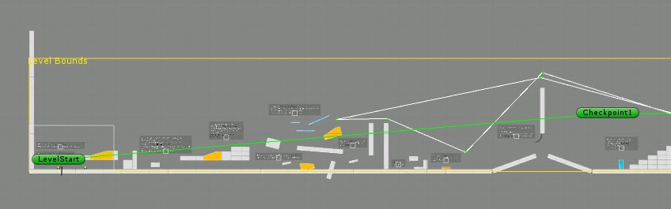

# 重生

> 这个页面讲解了游戏循环和重生机制。

## 重生（Respawn）如何工作？

在大部分平台游戏中，角色可以受到伤害，并且在生命值到达零时死亡。在 Corgi Engine 中这也是**默认的行为**。当角色受到伤害时，就开始了相关的一系列复杂的事件：

* 角色受到 `X` 点伤害，这是 Character 上的 `Health` 组件负责处理的
* 角色失去 `X` 点生命值
* 如果角色的生命值小于等于零，`Health` 组件将调用它的 `Kill()` 方法，并且通知 LevelManager 玩家角色已经死亡
* LevelManager 重置关卡，触发玩家角色和场景中潜在的其他对象的重生

重生的实现是通过检查玩家角色最后到达的检查点（Checkpoint），然后将它重置到那个位置，并且重置所有登记到该检查点的对象。对象会自动登记到场景中的检查点。如果你看一下任何一个 Demo 的 LevelManager 组件的 Inspector 视窗，都可以找到一个 `Checkpoint Attribution Axis` 复选框。默认情况下它被设置为 `X` 轴。比如说在一个横版关卡中（类似《超级马里奥》）有 3 个检查点，关卡中的每一个带有 **Autorespawn** 组件的敌人或对象在关卡开始的时候，都会登记到它左边的第一个检查点上。这意味着如果玩家角色在检查点 B 和 C 之间死亡，在它们之间那些可能已经被杀死的敌人都会复活。

如果你想要敌人或者对象可以重生，只需要为它们添加一个 **Autorespawn** 组件。

## 检查点（Checkpoints）

在 Corgi Engine 中创建和放置检查点**超级简单**，你需要做的就是创建一个空的 GameObject，然后为它添加一个 **Checkpoint** 组件，它就会自动地添加一个 **BoxCollider2D** 组件。接着要做的就是调整 BoxCollider2D 组件的尺寸，这个尺寸决定了触发这个检查点的区域大小，确保它足够大以保证角色经过时不会错过。你还可以在 Checkpoint 的 Inspector 视窗中设置朝向，这个方向决定了当角色重生时它会朝向哪个方向。

然后把检查点放置到场景中适当的位置，并且添加多几个。最后，你可以在 LevelManager 的 Inspector 视窗中，设定 **Checkpoint Attribution Axis**。如果关卡是横版的，设置它为 `X`；如果关卡是竖版的，设置它为 `Y`。当你按下 Play 按钮之后，在场景视图中会看到所有检查点根据被经过的顺序被一条绿线串联起来。

-------

[本页面的 Corgi Engine 官方英文原版链接](http://corgi-engine-docs.moremountains.com/respawn.html)

# Respawn

> **Summary:** This page goes over the game cycle and respawn mechanisms.

## How does respawn work?

In most platform games, your character can take damage, and eventually die if its health reaches zero. In the Corgi Engine that’s also the **default behaviour**. When your character takes damage, a relatively complex chain of events starts :

* your character takes X damage, this is handled by the Health component of your character
* it loses X health
* if its health goes below zero, the Health component calls its Kill() method and tells the LevelManager that the player is dead
* the LevelManager resets the level, triggering the Respawn of the player and potentially other objects within the scene

That Respawn is done by checking what checkpoint the player last reached, repositioning the player there, and also respawning all the objects registered to that checkpoint. Objects register automatically to checkpoints in the scene. If you look at any LevelManager in any of the demo scenes for example, you’ll see a “Checkpoint Attribution Axis” checkbox in its inspector. By default it’s set on the X axis. Let’s say you have a horizontal level (think Super Mario), and three checkpoints on it. Every enemy or object in that level with an **Autorespawn** component will, at the start of the level, register to the first checkpoint to its right. Which means that if your character dies between checkpoints B and C, all enemies it may have killed between them will respawn too.

If you want your enemies or objects to respawn, just put an **Autorespawn** component on them.

## Checkpoints

Creating and placing checkpoints in the Corgi Engine is **extremely simple**. All you have to do is create an empty game object, and add a **Checkpoint component** to it. It should automatically add a **BoxCollider2D** to it. All you have to do then is change the BoxCollider2D’s size. That size will determine the zone that will trigger the checkpoint, make it big enough so that your character won’t miss it. You can also set the facing direction from the Checkpoint component’s inspector. That’s the direction your player character will be facing when respawing.

You can then position your checkpoint in your scene, and add a few more. One last thing you can do is go to your LevelManager’s inspector, and define the **Checkpoint Attribution Axis**. If your level is horizontal, go for X, if it’s vertical for Y, etc. When you press play, you’ll see all your checkpoints linked by a green line in the order they’ll have to be crossed.

-------

