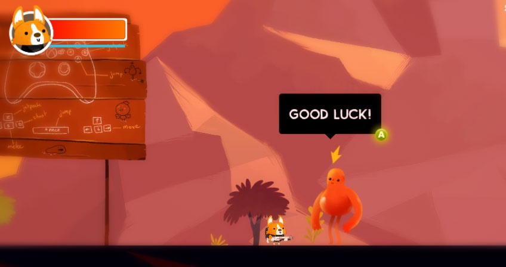
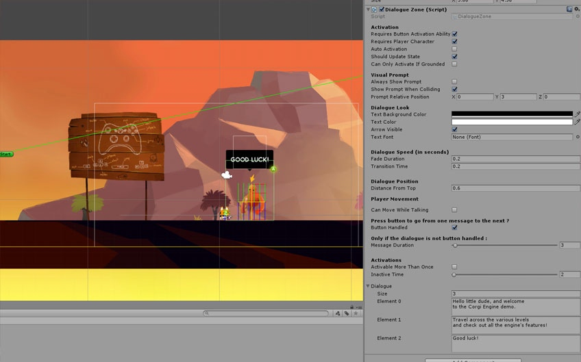
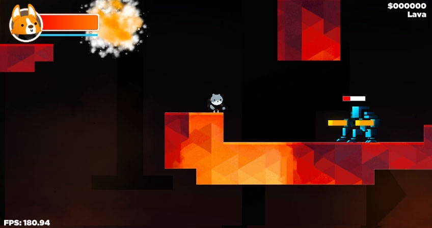

# 用户界面

[User Interface](http://corgi-engine-docs.moremountains.com/ui.html)

> 这个页面讲解了在 Corgi Engine 中 UI 如何工作。

## 简介

在专注于游戏玩法的同时，Corgi Engine 也包含了随处可见的用来与玩家沟通的 **GUI** 元素。通常它们只是充当占位符（因为你会用自己的美术资源替换它们），不过理解它们是如何工作的依然很有用处。

## UI Camera

引擎中的大部分关卡都配有两个[摄像机](https://github.com/Caizc/corgi-engine-docs/blob/master/3.General/3-9.%E6%91%84%E5%83%8F%E6%9C%BA.md)：一个普通的 2D 或 3D 摄像机，以及一个 UI 摄像机。后者负责显示游戏的 HUD，以及其他非游戏世界中的视觉元素。如果仔细看一下 UICamera Prefab，会发现它还包含了按钮、方向键、操纵杆和暂停界面等等。所有这些都是由位于 Prefab 顶层的 GUI Manager 组件控制的，它们都绑定到了 GUI Manager 组件的 Inspector 视窗中。

## 游戏 HUD

**HUD** 是 UICamera Prefab 的一部分，它包含了喷气能量条、血条、头像，以及得分、关卡名称和每秒帧数（FPS，Frames per Second）计数器。所有这些都绑定到了 GUI Manager 组件并且通过它的各种方法来更新。你可以随意定制它们的外观、字体等。

## 暂停界面

**暂停界面（Pause Screen）**是 UICamera 的一部分，包含了一个黑色的遮罩层、一些文本和按钮。你当然可以（也应当）定制它们，以适应你自己的按钮和美术风格。为此，只需要展开 UICamera Prefab，定位到 PauseSplash 然后进行更改即可。

## 对话窗口

引擎包含了一个**非常简单的对话系统**，让你可以在关卡中的任何地方显示单向对话或提示信息。只需要定义好一个区域（Zone）就可以使用它。区域是一个具有 BoxCollider2D 的 GameObject，决定了想要激活该区域角色所需处在的位置。最后再给它**添加一个 DialogueZone 组件**。也可以将这个区域对象附加到一个角色上（只需要在 Hierarchy 视图中将它嵌套在角色对象下，它就可以跟随角色到处移动啦）。

添加了 **DialogueZone** 组件之后，你需要设置它的 Inspector 视窗。有几个与激活（Activation）相关的复选框可以让你设置如何以及何时才能激活对话。可以设置是否显示提示按钮（默认是一个字母 `A` 小图标，可以随意替换）。接着你可以更改对话框的外观，通过调整文本和背景的颜色以及字体等。在 Inspector 视窗的最下方，你可以定义对白。如果对白超过 1 句，它们会**按照顺序**从上往下逐条显示。

## 血条（Healthbars）

**血条（Healthbar）**是可以添加到任何一个具有 `Health` 组件的角色上的组件。它可以在角色的上方显示一个代表**当前健康程度**的进度条。设置方法很简单：可以选择使用一个 ProgressBar Prefab 或者交由引擎来绘制它。如果是后者，你可以选择进度条的前景色和背景色、内边距和大小，以及进度条位置离角色中心的偏移值。除此之外，还可以设置它是否**持续可见**，还是只有在它每次受到伤害后的数秒之内可见。

-------

