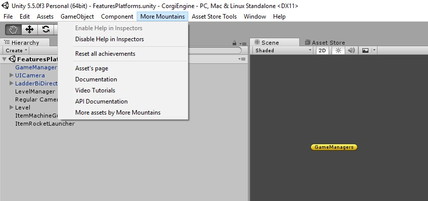
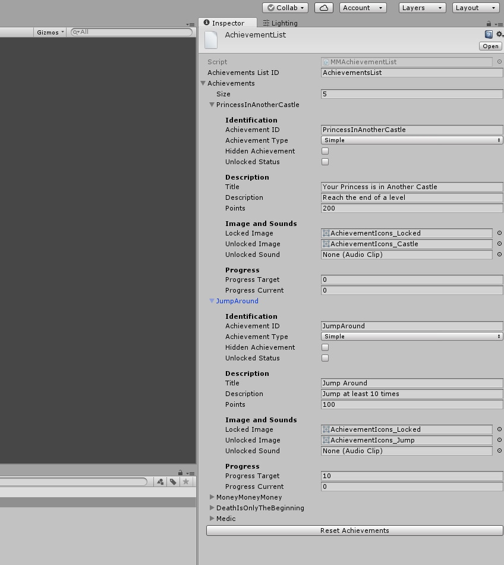
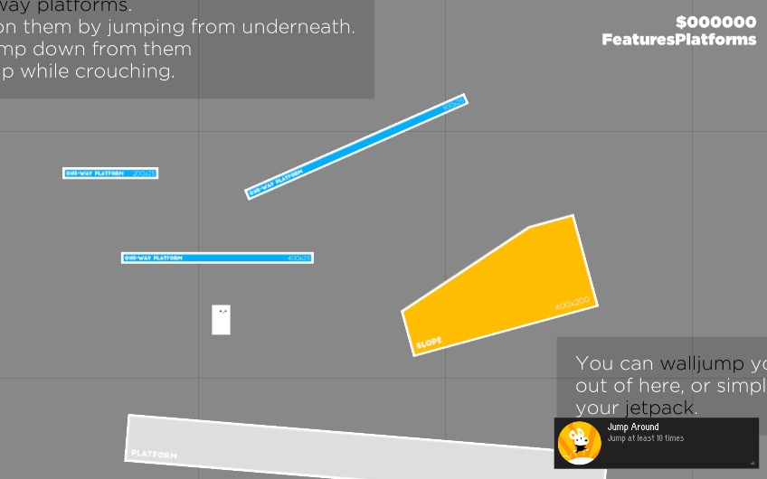

# 成就

[Achievements](http://corgi-engine-docs.moremountains.com/achievements.html)

> 这个页面讲解了如何使用 Corgi Engine 中的成就系统，以及如何为你的游戏定制它。

## 简介

在 v3.1 版本中介绍过，Corgi Engine 包含了一个简单易用又功能强大的成就系统。它可以设定、触发和保存成就。此外它还非常**模块化**且易于扩展，如果说你要将它接入特定平台的社交 API 的话。

## 重置成就

关于成就系统首先你要知道**如何重置它**（无论如何它是最常被提及的问题）。可以通过点击在 AchievementList 的 Inspector 视窗中底部的 `Reset Achievements` 按钮，或者通过顶部菜单，点击菜单项 `More Mountains > Reset all achievements` 来重置成就。



## AchievementList

关于成就，第二个重要的事情是知道**如何定义它们**，这是通过一个脚本对象（Scriptable Object）——AchievementList 来完成的。你可以创建一个新的，不过引擎资源中已经有一个可以供你修改了，可以在 `CorgiEngine/Common/Resources/Achievements` 目录下找到它。你可以选中它，然后通过它的 Inspector 视窗修改它的内容。



如上图所示，一个成就（Achievement）由 ID（脚本通过它来解锁它）、类型、标题、描述、关联的图片和声音，以及潜在的进度组成。有 2 种类型的成就：简单（`Simple`，类似于完成游戏、找到宝藏等唯一的东西）以及基于进度的（`Progress` Based，例如收集 50 个硬币、死 20 次等）。如果是基于进度的成就，你还需要指定解锁成就所需的进度目标。所有成就都只能解锁一次，当然啦，除非你重置它们。

## 解锁成就

在你将成就添加到列表（AchievementList）中后，接着就要在代码中让它可以被解锁。这可以在任何类中完成，并且具体在什么地方解锁理所当然地取决于你的游戏和成就。引擎中有一些例子可供你更好地理解它是怎么做的。值得一提的是，本成就系统使用了**事件（Events）**，如果你想要全面了解它是如何工作的，可以[阅读这个页面](https://github.com/Caizc/corgi-engine-docs/blob/master/3.General/3-7.%E4%BA%8B%E4%BB%B6.md)。

解锁成就非常简单，可以通过一行代码来解决。将这行代码放在哪里取决于你想要做什么。我建议扩展 `AchievementRules` 类，以将所有成就相关的代码集中到同一个地方，同时让该类监听与它们相关的事件和行为（看看这个类的代码，如果你想知道如何处理的话）。不过如果你喜欢的话也可以在任何地方完成成就的解锁。

这里示范了如何解锁一个叫做 `theFirestarter` 的简单成就：

```csharp
MMAchievementManager.UnlockAchievement("theFirestarter");
```

而这个则是如何增加一个基于进度的成就的当前进度：

```csharp
MMAchievementManager.AddProgress ("toInfinityAndBeyond", 1);
```

当然你可以把 `1` 替换为任何其他值以加快进度。

## MMAchievementRules

正如前面提到的，目前成就是由 `AchievementRules` 类来触发的。它继承了 `MonoBehaviour` 类，所以在每个有成就被解锁的场景中，你需要把它添加到一个空的 GameObject 对象上。不过成就是全局（Global）的，因此如果你在关卡 A 中解锁了一个成就，就不能在关卡 B 中再次解锁它。即便你不想使用 `AchievementRules` 类，也请确保在游戏开始的时候，在某个管理类（Manager）中添加以下几行代码：

```csharp
// we load the list of achievements, stored in a ScriptableObject in our Resources folder.
MMAchievementManager.LoadAchievementList ();
// we load our saved file, to update that list with the saved values.
MMAchievementManager.LoadSavedAchievements ();
```

## 成就显示



引擎包含了一个成就显示组件。要使用它的话，需要给它一个「容器」（Container）。我发现使用 `Vertical Layout Group` 组件作为容器的效果很好，不过你可以使用其他任何东西代替。需要为容器添加一个 `MMAchievementDisplayer` 组件。在它的 Inspector 视窗中，你可以指定当一个成就被解锁时要实例化哪个 Prefab，它会在屏幕上存在多长时间，以及过渡过程应该多快。当然你也可以修改或者创建一个新的 Prefab，以你想要的方式来显示成就。需要为这个 Prefab 添加一个 `MMAchievementDisplayer` 组件，然后再为它绑定 GUI 元素。

## 对接 Steam、iOS 等

为了避免对外部的代码产生**依赖**，引擎资源中并没有现成的 Steam、Google Play、iOS 或者其他平台相关的接口。不过这个成就系统在创建时就已经考虑到了这种类型的演化，所以你可以轻松的扩展它以及调用必要的方法，因为它们的成就结构体都大同小异。最好的方式是创建一个监听 `MMAchievementUnlockedEvent` 的类（每次有一个成就被解锁时该事件就会被触发），然后再把相应的成就传递给目标平台的社交 API。

-------


