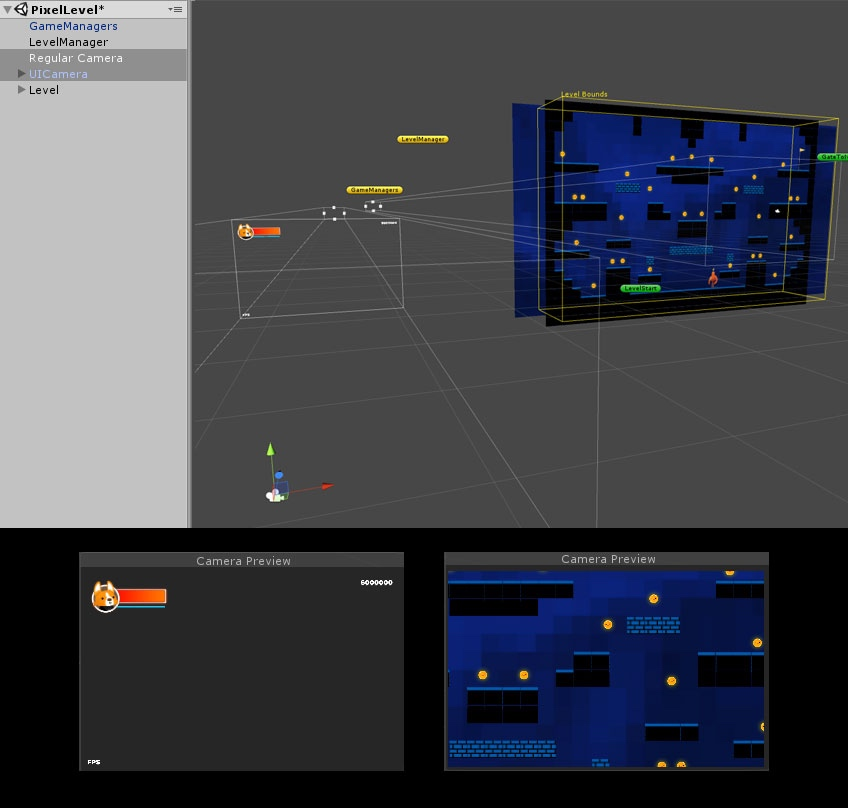

# 摄像机

> 这个页面讲解了在 Corgi Engine 中如何使用摄像机。

## 简介

和其他所有 Unity 项目一样，关卡中需要有一个摄像机才能看到东西。Corgi Engine 包含了一些摄像机专用的脚本。要说明的一点是，**你可以在引擎中使用任何摄像机脚本**，或者实现你自己的，或者在提供的脚本上继续构建。关于摄像机**没有什么是强制的**，你可以随意定制。这个页面介绍了主要的脚本以及如何使用它们。

## 普通摄像机和 UI 摄像机

在 Corgi Engine 的大部分 Demo 场景中，默认情况下你会看到**两个摄像机**：一个普通摄像机（2D、3D、跟随或者不跟随玩家角色等）和一个 UI 摄像机。UICamera 的 `Culling Mask` 被设置为 `UI`，也就是说它只显示被标记为 `UI` 的对象，并且被设置为**叠加（superimpose）**到主摄像机（Main Camera）的显示之上。

## CameraController

`CameraController` 组件**可以被添加到任何摄像机上**（正交 `Orthographic` 或透视 `Perspective`），它让摄像机移动并且尝试跟随玩家角色。默认情况下，它将**以你的主角**（你在场景的 LevelManager 中设置的第一个玩家角色）**为中心**。在它的 Inspector 视窗中，你可以设定一些偏移量，这些偏移量在特定的情况下会被添加到摄像机的位置上。而 `Camera Offset` 则被应用在所有情况下。`Horizontal Look Distance` 在向左或向右移动时被应用，`Manual Up Down Look Distance` 则被应用在向上或向下看时。你还可以设定 `Look Ahead Trigger` 的值来定义移动多长的距离才会触发偏移量的应用。

接着你可以通过一些设置项来设定**移动速度（Movement Speed）**和**缩放值（Zoom Values）**。最后你还可以通过勾选一个复选框来自动启用或禁用移动设备上的特效。如果把它禁用，当运行在 **Android** 或 **iOS** 上时，所有添加到摄像头上的标准资源特效都会**被禁用**。

引擎资源中还包含了一个**多玩家摄像机控制器（Multiplayer Camera Controller）**。它与单玩家摄像机基本上是一样的，但它会跟随场景中的所有玩家角色。

## 像素完美（Pixel Perfect）

在 `CameraController` 的 Inspector 视窗中，你还可以设置是否需要一个像素完美的摄像机（Pixel Perfect Camera）。它对于 2D 像素艺术风格的游戏最适合，像素完美的摄像机将禁用缩放，而是根据你在 Inspector 视窗中的设置（你导出的 Sprite 的目标垂直分辨率）和要求的 PPU（Pixels Per Unit）来确定一个新的正交摄像头尺寸（Size）。

如果不设置 `Pixel Perfect` 的话，可能会发生 Sprite 没有被正确渲染的情况，因为你的 Sprite 的每一个像素有可能最终并不会整好显示在一个屏幕像素上。你可以执行以下操作来避免这种情况：

* 根据某个目标垂直分辨率（例如 768px）创建你的资源，然后在 `CameraController` 的 Inspector 视窗中将这个值设置给 `Reference Vertical Resolution`。
* 为每一个 Sprite 设定一个共同的 `PPU` 值（例如 32），然后在 `CameraController` 的 Inspector 视窗中将这个值设置给 `Reference Pixels Per Unit`。
* 在 Sprite 中，设置 `Compression` 为 `None`，`Filter Mode` 为 `Point(no filter)`。

你也可以在 Unity 的这篇[博客文章](https://blogs.unity3d.com/cn/2015/06/19/pixel-perfect-2d/)中学习更多关于 Pixel Perfect Camera 的知识。

## 视差效果（Parallax）

Corgi Engine 包含了将视差效果添加到你的游戏中所需的一切。基本上有两种方式可以做到：

* **3D 视差效果：**最简单的方式是做一个 2.5D 场景，这种方式 Unity 是内建支持的。也就是说你需要一个 3D 场景并且是从左到右移动的。目录 `CorgiEngine/Demos/Corgi3D/3DLevel` 下的 Demo 场景很好的展示了这种情况。**你不需要任何特殊的操作就可以获得视差效果**，只需要将一些元素放置在比你的主平面（角色移动所在的平面）离摄像机更远的地方，然后当你的角色移动（并且摄像机跟随）时它们看起来就会左右移动得**慢一些**。把它们放置在摄像机和你的主平面之间，则当摄像机移动时它们看起来就会移动得**快一些**。

* **2D 视差效果：**然而要获得类似的 2D 效果，你需要一些 Corgi Engine 脚本的帮助。首先，你需要一个在其顶层带有 `CameraController` 脚本组件的摄像机，你可以自己组装一个，或者从 Minimal Demo 场景中拷贝一个。在摄像机上需要添加一个 `ParallaxCamera` 组件，并且保留勾选它的 `Move Parallax` 复选框。然后添加一个 `ParallaxElement` 组件到场景中任何一个需要与摄像机同步移动的对象上。

这里有一些选项需要设置：水平和竖直速度（数值越高移动得越快），以及它移动的方向是否应该与摄像机的相反。大部分情况下，**需要勾选这个复选框**（`Move In Opposite Direction`）。然后你可以按下 Play 按钮，看看效果如何，或者在编辑模式下，直接来回移动摄像机看看这些元素的表现如何。这对于美术人员和关卡设计师来说很有用，他们可以检查当摄像机到达某个位置时某个背景元素所在何处。剩下的就是调整速度参数，以让人产生深度感（impression of depth），如果有超过一个层次的平台的话。例如，如果有 3 个背景元素：一棵树、一座山和一个月亮，设置它们各自的参数为 `0.5`、`0.3` 和 `0.1` 应该会获得很好的深度感。

最后需要关注的就是 `LevelBackground` 脚本了。对于 2D 关卡来说很有用，它可以让你把一个 Sprite 「粘」在摄像机上，它会一直跟随着摄像机，通常用于实现天空背景。

-------

[本页面的 Corgi Engine 官方英文原版链接](http://corgi-engine-docs.moremountains.com/cameras.html)

# Cameras

> **Summary:** This page explains how to use cameras in the Corgi Engine.

## Introduction

Like for any other Unity project, you’ll need a Camera in your level to see the action. The Corgi Engine includes a few Camera specific scripts. Note that **you can use any Camera script with the asset**, or implement your own, or build on top of the provided scripts. There’s **nothing mandatory here** and you can do whatever you want. This page covers the main scripts and how to use them.

## Regular and UI Cameras

By default, in most demo scenes of the Corgi Engine, you’ll notice **two cameras** : a regular camera (2D, 3D, following the player or not, etc) and a UI Camera. The UI Camera’s Culling Mask is set on UI, which means it’ll only render UI tagged stuff, and is setup to be **superimposed** over the main camera’s render.

## CameraController

The CameraController component **can be added to any camera** (orthographic or perspective), and it’ll make it move and try to follow the player. By default it’ll **center on your main character** (the first playable Character you’ll set in the scene’s LevelManager). From its inspector, you can define a few offsets, that will be added to this position depending on certain situations. The Camera offset will be applied at all times. The Horizontal Look Distance will be applied when moving left or right. Same thing for the up/down look distance. And you can also define with the LookAheadTrigger value how much you need to move for that offset to apply.

Then you can define **movement speed** and **zoom values**, with pretty self-explanatory settings. The final thing you can check is a checkbox that will automatically enable or disable effects on mobile. If you set it off, all standard assets effects added to the camera **will be disabled** when running on **Android** or **iOS**.

The asset also includes a **multiplayer camera controller**. It’s basically the same idea as the single player one, but it’ll track all playable characters in the scene.

## Pixel Perfect

From the CameraController’s inspector, you’ll also be able to set whether or not you want a pixel perfect camera. Most suited for 2D pixel art games, the pixel perfect camera will disable zoom, and instead determine a new orthographic camera size based on your settings in the inspector (the target vertical resolution at which for which you produced your sprites) and your desired PPU (pixels per unit) value.

Without this PixelPerfect setting, it can happen that a sprite is not rendered correctly, as each pixel of your sprite might not end up on one rounded screen pixel. To avoid this, here are a few things you can do :

* Create your assets for a target vertical resolution (768px for example), and set that value as your Reference Vertical Resolution in the CameraController’s inspector.
* For each of your sprites, define a common PPU value (32 for example), and set that value as your Reference Pixels Per Unit value in the CameraController’s inspector.
* On your sprites, set compression to None, and Filter Mode to Point (no filter).

You can also learn more about Pixel Perfect cameras in Unity [in this blog post](https://blogs.unity3d.com/cn/2015/06/19/pixel-perfect-2d/).

## Parallax

The Corgi Engine includes everything you need to add parallax effects to your game. There are basically two ways to do it.

* **3D Parallax** : the easiest way, built-in in Unity, is to have a 2.5D scene. Meaning you have a 3D scene and lateral movement from left to right. The Demos/Corgi3D/3DLevel demo scene is a good showcase of that. You don’t need anything in particular for it to work, just position some elements further from the camera than your main plane (the plane where the character moves) and they’ll move slower from left to right when your character moves (and the camera follows). Position them between the camera and your main plane, and they’ll appear to move faster when the camera moves.

* **2D Parallax** : to achieve the same effect in 2D though, you’ll need the help of a few of the Corgi Engine’s scripts. First of all, you’ll need a Camera, with a CameraController script on top of it. You can assemble one yourself, or copy one from the Minimal demo scene. On that camera you need to add a ParallaxCamera component, and leave its MoveParallax checkbox checked. Then, on any gameobject in your scene that you want to move on sync with the camera movement, you can just add a ParallaxElement component.

There are a few options to setup there : vertical and horizontal speed (the higher the value, the faster it’ll move), and whether or not this should move in the opposite direction as the camera. In most cases **you’ll want to leave that checked**. Then you can either press play and check the result, or simply, while in editor mode, move the camera around and see how these elements react. This is useful for artists and level designers, you can check where a background element will be when the camera reaches a certain position. All that’s left to do is adjust speed values to give an impression of depth if you have more than one plane. For example, if you have 3 background elements : a tree, a mountain and the moon, respective values of 0.5, 0.3 and 0.1 should give a good impression of depth.

One last thing to consider is the LevelBackground script. Useful for 2D levels, it allows you to glue a sprite to the camera, and it’ll just follow it everywhere. Mostly used for skies.

-------

