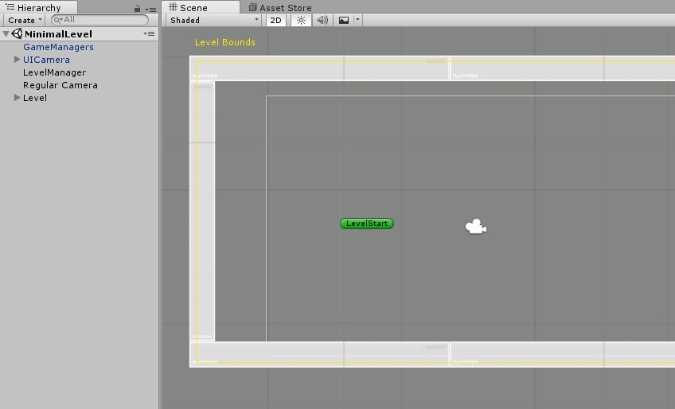
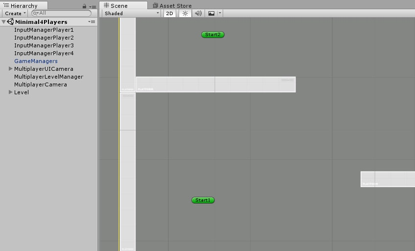

# 最小场景要求

> 这个页面描述了为了让你的引擎跑起来，你的场景中至少需要包含的所有 GameObject。

## 简介

与大多数 Unity 项目类似，在 Corgi Engine 中，一个关卡由一个场景组成（a level is made of a Scene）。你可以往场景中添加很多东西（梯子，敌人等等），它可以很庞大，也可以很精简，一切都取决于你。但无论你想做什么，引擎都需要一些基本的组件才能够运作。Corgi Engine 包含了两个最小场景的示例，这些场景展示了标准情况下的最小组件要求。严格来说，你甚至还可以从中移除更多东西，但它们已经是良好的初始场景了。

## 最小单玩家场景

## 最小多玩家场景

-------

